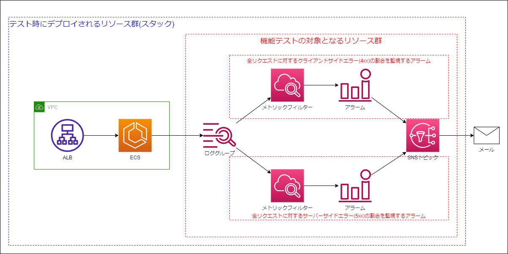

この記事は[NTTテクノクロス Advent Calendar 2024シリーズ2](https://qiita.com/advent-calendar/2024/ntt-tx)の25日目の記事であり、**前日24日の記事と合わせた連載の第2回目**になります。

メリークリスマス。NTTテクノクロスの堀江です。普段はAWSやAzure上でのシステム設計、構築や実装、調査検証系の案件を幅広く担当しています。

---

# 1. はじめに

【理論編】では、テストピラミッドの概念をAWS CDKインフラ開発に適用することを通して、インフラにおけるテストカテゴリとその手法、それらのテストの運用方針を模索し理論化を行いました。
本記事【実践編】ではシンプルなWEBアプリケーションのCDKコードを題材として、各種テストを実装しテスト戦略を運用する過程をデモンストレーションします

- コンパイルテスト(きめ細かなアサーションテスト)に関しては、効果的なテスト観点も併せて検討し、実装例を提示します
- 機能テストに関して、CDKコードに対しても一般的なソフトウェア開発におけるプラクティス(デザインパターンやSOLID原則)を意識することでテストの実行速度やコストを改善出来る可能性があることを示します

---

## 1.1. サンプルインフラの構成

本記事では、以下のような構成のインフラを題材にします。


<!--  -->

- １つのVPC内にALBとFargateのWEBアプリケーション実行基盤
- Fargate上のWEBアプリケーション(nginx)のログはCloudWatch Logsロググループに収集される
- ロググループ上のログには以下の2種類のメトリクスフィルターが設定され、それぞれ特定の条件を満たした場合にCloudWatch AlarmからSNS経由でアラームが発報され、メールが送信される
  - 全リクエストに対するクライアントサイドエラー(4xx)の割合を計算し、閾値を超えた場合にアラームを発報する
  - 全リクエストに対するサーバーサイドエラー(5xx)の割合を計算し、閾値を超えた場合にアラームを発報する

このアーキテクチャを以下のような`SampleWebApp`コンストラクトとして実装します。このコードに対して具体的にどのようなテストコードが書けるか、そして実際のテストがどうなるかをデモンストレーションします。

<details><summary>sample-web-app.ts</summary>

```js:sample-web-app.ts
import {
  aws_elasticloadbalancingv2 as elbv2,
  aws_ec2 as ec2,
  aws_logs as logs,
  aws_ecs_patterns as ecsPatterns,
  aws_ecs as ecs,
  aws_ecr as ecr,
  aws_cloudwatch as cw,
  aws_sns as sns,
  Duration,
  aws_cloudwatch_actions as cwActions,
} from "aws-cdk-lib";
import { Construct } from "constructs";

export interface SampleWebAppProps {
  /**
   * ECR上に予め用意したDockerイメージ名。
   * 
   * **タグ名やドメイン名は含めないこと(例 : イメージのURIが`123456789012.dkr.ecr.ap-northeast-1.amazonaws.com/nginx:latest`であれば、`nginx`とだけ指定すること)**
   */
  webAppImageName: string;
  /**
   * CloudWatchアラームの発報先となるSNSトピック
   */
  topic: sns.ITopic;
}

export class SampleWebApp extends Construct {
  public readonly webappLogGroup: logs.ILogGroup;
  public readonly alarms: { [name: string]: cw.IAlarm } = {};
  constructor(scope: Construct, id: string, props: SampleWebAppProps) {
    super(scope, id);

    // バリデーションチェック
    if (props.webAppImageName.includes("/") || props.webAppImageName.includes(":")) {
      throw Error(`webAppImageName : ${props.webAppImageName}にはタグ名やドメイン名は含めないこと。(例 : イメージのURIが"123456789012.dkr.ecr.ap-northeast-1.amazonaws.com/nginx:latest"であれば、"nginx"とだけ指定すること)`)
    }

    // L3コンストラクトを使用してVPCとALB、Fargateの一連のリソース群を作成する
    // CloudWatch Logsのみコンストラクト外から注入する
    this.webappLogGroup = new logs.LogGroup(this, "LogGroup", {});
    const albecs = new ecsPatterns.ApplicationLoadBalancedFargateService(
      this,
      "albecs",
      {
        listenerPort: 80,
        protocol: elbv2.ApplicationProtocol.HTTP,
        openListener: true,
        taskSubnets: { subnetType: ec2.SubnetType.PRIVATE_WITH_EGRESS },
        cpu: 256,
        memoryLimitMiB: 512,
        desiredCount: 2,
        taskImageOptions: {
          containerName: "webapp",
          image: ecs.EcrImage.fromEcrRepository(
            ecr.Repository.fromRepositoryName(
              this,
              "WebAppRepository",
              props.webAppImageName,
            ),
          ),
          logDriver: ecs.LogDrivers.awsLogs({
            logGroup: this.webappLogGroup,
            streamPrefix: "webapp",
          }),
        },
      },
    );

    /**
     * 以下、CloudWatch Logsに収集されたログに対してメトリクスフィルターとアラームを設定し、
     * アラームアクションとしてSNSトピックにメッセージを発報する。
     */

    // 受信した全てのリクエスト数をログからカウントするメトリクス
    // ※ALBからのヘルスチェックリクエストは除外する
    const allRequestCount = this.webappLogGroup
      .addMetricFilter("AllRequestCount", {
        filterPattern: {
          logPatternString:
          '[..., agent != "ELB-HealthChecker*", xForwardedFor]',
        },
        metricName: "AllRequestCount",
        metricNamespace: "WebApp",
        defaultValue: 0,
        metricValue: "1",
        unit: cw.Unit.COUNT,
      })
      .metric({
        period: Duration.minutes(1),
        statistic: "sum",
        unit: cw.Unit.COUNT,
      });
    // クライアントサイドエラー(4xx)となったリクエスト数をログからカウントするメトリクス
    const cseRequestCount = this.webappLogGroup
      .addMetricFilter("CSERequestCount", {
        filterPattern: {
          logPatternString:
            '[..., status_code = 4*, bytes, referer, agent != "ELB-HealthChecker*", xForwardedFor]',
        },
        metricName: "CSERequestCount",
        metricNamespace: "WebApp",
        defaultValue: 0,
        metricValue: "1",
        unit: cw.Unit.COUNT,
      })
      .metric({
        period: Duration.minutes(1),
        statistic: "sum",
        unit: cw.Unit.COUNT,
      });
    // 10分間におけるクライアントサイドエラー率が25%以上の場合に
    // アラーム状態となりSNSトピックにメッセージを発報するアラーム
    const cseRateAlarm = new cw.Alarm(this, "cseRateAlrm", {
      evaluationPeriods: 1,
      threshold: 25,
      comparisonOperator:
        cw.ComparisonOperator.GREATER_THAN_OR_EQUAL_TO_THRESHOLD,
      treatMissingData: cw.TreatMissingData.NOT_BREACHING,
      actionsEnabled: true,
      metric: new cw.MathExpression({
        expression: "(cse / (all+0.01)) * 100",
        usingMetrics: {
          cse: cseRequestCount,
          all: allRequestCount,
        },
        period: Duration.minutes(10),
      }),
    });
    cseRateAlarm.addAlarmAction(new cwActions.SnsAction(props.topic));
    this.alarms["cseRate"] = cseRateAlarm;

    // サーバーサイドエラー(5xx)となったリクエスト数をログからカウントするメトリクス
    const sseRequestCount = this.webappLogGroup
      .addMetricFilter("SSERequestCount", {
        filterPattern: {
          logPatternString:
            '[..., status_code = 5*, bytes, referer, agent != "ELB-HealthChecker*", xForwardedFor]',
        },
        metricName: "CSERequestCount",
        metricNamespace: "WebApp",
        defaultValue: 0,
        metricValue: "1",
        unit: cw.Unit.COUNT,
      })
      .metric({
        period: Duration.minutes(1),
        statistic: "sum",
        unit: cw.Unit.COUNT,
      });

    // 1分間におけるサーバーサイドエラー率が10%以上の場合に
    // アラーム状態となりSNSトピックにメッセージを発報するアラーム
    const sseRateAlarm = new cw.Alarm(this, "SSERateAlrm", {
      evaluationPeriods: 1,
      threshold: 10,
      comparisonOperator:
        cw.ComparisonOperator.GREATER_THAN_OR_EQUAL_TO_THRESHOLD,
      treatMissingData: cw.TreatMissingData.NOT_BREACHING,
      actionsEnabled: true,
      metric: new cw.MathExpression({
        expression: "(sse / (all+0.01)) * 100",
        usingMetrics: {
          sse: sseRequestCount,
          all: allRequestCount,
        },
        period: Duration.minutes(1),
      }),
    });
    sseRateAlarm.addAlarmAction(new cwActions.SnsAction(props.topic));
    this.alarms["sseRate"] = sseRateAlarm;
  }
}

```

</details>

---

# 2. コンパイルテスト

まずはこのコンストラクトに対してどのようなコンパイルテスト(きめ細かなアサーションテスト)を書くべきか見ていきましょう。

:::note info
ささやかな宣伝も兼ねて、本記事ではきめ細かなアサーションテストの実装例では標準の`aws-cdk-lib/assertions`モジュールを使用せず、私が開発しリリースした[aws-cdk-utul](https://qiita.com/horietakehiro/items/ef1629242d8130c9b88d)ライブラリを使用させてもらいますので、悪しからず。(コードを読む分には特に支障は無いと思います。)
:::

---

## 2.1. コンパイルテストの実装観点

【理論編】では、「コンパイルテストはあまり実装しすぎるべきでない」と述べました。
なぜならコンパイルテストはあくまでも**CDKコードの振る舞い**をテストしているのであって、本当にテストしたい対象である**AWSリソースの振る舞い**をテストできるわけではないからです。

加えて、少なくとも`aws-cdk-lib`ライブラリで提供されているコンストラクト(例えば`aws_s3.Bucket`)は品質が十分に担保されていると考えて良いでしょう。そのため、標準的なコンストラクトの振る舞いを事細かにテストする意義は非常に低いです。(例えるなら、JavaScriptで`fetch`関数そのものの振る舞いをテストするためのコードをわざわざ書くようなもの)

更に、例えばコンストラクトの実装の詳細に踏み込んだテストを書き過ぎてしまうと、テストが壊れやすくなりメンテナンスコストも増大する原因になり得ます。

<details><summary>効果が薄いコンパイルテストの一例</summary>

```js:効果が薄いコンパイルテストの一例
import { TypedTemplate } from "@horietakehiro/aws-cdk-utul/lib/assertions";
import { AWS_S3_BUCKET } from "@horietakehiro/aws-cdk-utul/lib/types/cfn-resource-types";
import { aws_s3 as s3, Stack } from "aws-cdk-lib";

const stack = new Stack()
new s3.Bucket(stack, "Bucket", {
  versioned: true
})
const template = TypedTemplate.fromStack(stack)
// 単に標準コンストラクトの振る舞いをテストしているに過ぎない
test("S3バケットのバージョニングが有効化されている", () => {
  template.hasResource(AWS_S3_BUCKET({
    Properties: {
      VersioningConfiguration: {
        Status: "Enabled"
      }
    }
  }))
})
```
</details>


ではコンパイルテストはどのような観点でコンストラクトをテストすべきでしょうか。

幸い、[AWS CDK における単体テストの使い所を学ぶ](https://aws.amazon.com/jp/builders-flash/202411/learn-cdk-unit-test/)というbuilders.flashの記事にて、その指針として個人的にも非常に納得できる内容が記載されています(以降、「コミュニティ記事」と呼称)。その内容をベースにしつつ、自分自身の言葉に直して観点を整理します。

コミュニティ記事で述べられている、きめ細かなアサーションテストの実装観点は以下の5点[^1]です。

- ループ処理に対するテスト
- 条件分岐に対するテスト
- プロパティのoverrideに対するテスト
- 特に保証したい定義に対するテスト
- propsを使った値の指定に対するテスト

個人的には「ループ処理」と「条件分岐」は「プログラムとしての処理フローに対するテスト」といった言葉で包括しようと思います。また上記に加えて、「副作用に対するテスト」という独自の観点も追加しようと思います。以上から、本記事で提示するコンパイルテスト(きめ細かなアサーションテスト)の実装すべき観点は以下の5つです。

- [プログラムとしての処理フローに対するテスト](#211-プログラムとしての処理フローに対するテスト)
- [プロパティのoverrideに対するテスト](#212-プロパティのoverrideに対するテスト)
- [特に保証したい定義に対するテスト](#213-特に保証したい定義に対するテスト)
- [propsを使った値の指定に対するテスト](#214-propsを使った値の指定に対するテスト)
- [副作用に対するテスト](#215-副作用に対するテスト)

---

### 2.1.1. プログラムとしての処理フローに対するテスト

コンストラクト内で条件分岐(`if, switch`)や繰り返し処理(`for, while`)といった処理フローを実装している場合、そのフローが期待通りに動作しているかを試験で確認すべきです。
コミュニティ記事上の表現を拝借して言い換えるなら、「手続き的な」処理が実装されている箇所はテスト対象となり得ます。

<details>
<summary>プログラムとしての処理フローに対するテストの例</summary>

```js:プログラムとしての処理フローに対するテストの例
import { TypedTemplate } from "@horietakehiro/aws-cdk-utul/lib/assertions";
import { AWS_S3_BUCKET } from "@horietakehiro/aws-cdk-utul/lib/types/cfn-resource-types";
import { aws_s3, RemovalPolicy, Stack } from "aws-cdk-lib";
import { Construct } from "constructs";
interface MyBucketProps {
  autoDeleteObjects?: boolean;
  appNames: string[];
}
class MyBucket extends Construct {
  constructor(scope: Construct, id: string, props: MyBucketProps) {
    super(scope, id);

    // アプリケーションごとにバケットを作成
    props.appNames.forEach((appName) => {
      new aws_s3.Bucket(this, `Bucket${appName}`, {
        // オブジェクトの自動削除設定が明示的に指定されたときのみ有効化する
        autoDeleteObjects: props.autoDeleteObjects ?? false,
        removalPolicy: props.autoDeleteObjects
          ? RemovalPolicy.DESTROY
          : RemovalPolicy.RETAIN,
      });
    });
  }
}

test("アプリケーションの数だけバケットが作成される", () => {
  const stack = new Stack();
  new MyBucket(stack, "Bucket", { appNames: ["app1", "app2", "app3"] });
  const template = TypedTemplate.fromStack(stack);

  template.resourceCountIs(AWS_S3_BUCKET, 3);
});
test("デフォルトではオブジェクトの自動削除設定は無効化される", () => {
  const stack = new Stack();
  new MyBucket(stack, "Bucket", { appNames: ["app1"] });
  const template = TypedTemplate.fromStack(stack);

  template.hasResource(AWS_S3_BUCKET({ DeletionPolicy: "Retain" }));
  template.template.resourceCountIs("Custom::S3AutoDeleteObjects", 0);
});
test("`props`の`autoDeleteObjects`をtrueに設定することで、オブジェクトの自動削除設定が有効か化される", () => {
  const stack = new Stack();
  new MyBucket(stack, "Bucket", {
    autoDeleteObjects: true,
    appNames: ["app1"],
  });
  const template = TypedTemplate.fromStack(stack);

  template.hasResource(AWS_S3_BUCKET({ DeletionPolicy: "Delete" }));
  template.template.resourceCountIs("Custom::S3AutoDeleteObjects", 1);
});
```

</details>

---

### 2.1.2. プロパティのoverrideに対するテスト

CDKではL2コンストラクトのエスケープハッチとして、CFNリソース定義(L1コンストラクトとしてのリソース定義)を直接書き換えることが可能です。

この場合、CDKコンストラクトからCFNリソースへの変換という、本来は`aws-cdk-lib`ライブラリのコンストラクトが担っていた(そして十分に品質が担保されていた)振る舞いの責任を実装者が担うことになるため、テストすべきでしょう。


<details>
<summary>プロパティの上書きに対するテストの例</summary>

```js:プロパティの上書きに対するテストの例
import { TypedTemplate } from "@horietakehiro/aws-cdk-utul/lib/assertions";
import { AWS_S3_BUCKET } from "@horietakehiro/aws-cdk-utul/lib/types/cfn-resource-types";
import { aws_s3 as s3, Stack } from "aws-cdk-lib";
import { Match } from "aws-cdk-lib/assertions";
import { Construct } from "constructs";

class MyBucket extends Construct {
  constructor(scope: Construct, id: string) {
    super(scope, id);

    const bucket = new s3.Bucket(this, "Bucket", {});
    const cfnBUcket = bucket.node.defaultChild as s3.CfnBucket;
    cfnBUcket.addPropertyOverride(
      "NotificationConfiguration.EventBridgeConfiguration.EventBridgeEnabled",
      true
    );
  }
}

const stack = new Stack();
new MyBucket(stack, "MyBucket");
const template = TypedTemplate.fromStack(stack);
test("EventBridgeへのイベント通知設定が有効化されている", () => {
  template.hasResource(
    AWS_S3_BUCKET({
      Properties: {
        NotificationConfiguration: {
          EventBridgeConfiguration: Match.objectLike({
            EventBridgeEnabled: true,
          }),
        },
      },
    })
  );
});
```

</details>

---

### 2.1.3. 特に保証したい定義に対するテスト

コンストラクトの特定の設定がそのシステムやコンプライアンス上重要な意味を持つ場合、その内容をテストケースとして実装し試験することで、実装の意図を明確にし、違反を将来に渡って防ぐことが期待できます。このような場合、振る舞い自体は十分に信頼できて改めてテストする価値が無い場合でも、明示的にテストを実装する意味があるといえます。

:::note warn
特定のコンプライアンスやルールへの準拠をコンストラクト横断的に徹底したい場合は、[Aspects](https://docs.aws.amazon.com/ja_jp/cdk/v2/guide/aspects.html)等を利用するのがより有効である可能性もあります。
:::

<details>
<summary>特に保証したい定義に対するテストの例</summary>

```js:特に保証したい定義に対するテストの例
import { TypedTemplate } from "@horietakehiro/aws-cdk-utul/lib/assertions";
import { AWS_S3_BUCKET } from "@horietakehiro/aws-cdk-utul/lib/types/cfn-resource-types";
import { aws_s3 as s3, Stack } from "aws-cdk-lib";
import { Construct } from "constructs";

class SaaSBucket extends Construct {
  constructor(scope: Construct, id: string) {
    super(scope, id);
    // このバケットは連携するSaaSの都合で、
    // 必ずバケット名を`saas-hoge-`から始める必要がある
    new s3.Bucket(this, "Bucket", {
      bucketName: `saas-hoge-${Stack.of(this).region}-${Stack.of(this).account}`,
    });
  }
}

const stack = new Stack();
new SaaSBucket(stack, "SaaSBucket");
const template = TypedTemplate.fromStack(stack);
test("SaaS連携用のバケットは、SaaS側の都合で必ずバケット名を`ssas-hoge-`から始める必要がある", () => {
  const { def } = template.getResource(AWS_S3_BUCKET());
  expect(JSON.stringify(def.Properties?.BucketName)).toContain("saas-hoge-");
});
```

</details>

---

### 2.1.4. propsを使った値の指定に対するテスト

一般的にコンストラクトでは`props`という引数でコンストラクトの外側から値を注入することがよくあります。コンストラクト内でそれらの値を適切に使用することは実装者の責任であるため、この点をテストすることは重要であると言えます。

<details>
<summary>propsを使った値の指定に対するテスト</summary>

```js:propsを使った値の指定に対するテスト
import {
  ExtraMatch,
  TypedTemplate,
} from "@horietakehiro/aws-cdk-utul/lib/assertions";
import {
  AWS_KMS_KEY,
  AWS_S3_BUCKET,
} from "@horietakehiro/aws-cdk-utul/lib/types/cfn-resource-types";
import { aws_s3 as s3, aws_kms as kms, Stack } from "aws-cdk-lib";
import { Construct } from "constructs";

interface MyBucketProps {
  cmk: kms.IKey;
}
class MyBucket extends Construct {
  constructor(scope: Construct, id: string, props: MyBucketProps) {
    super(scope, id);
    new s3.Bucket(this, "Bucket", {
      encryption: s3.BucketEncryption.KMS,
      // 本来は下記のようにpropsで指定されたCMKを指定すべきだが指定が漏れている
      // この場合BucketのL2コンストラクトは自動的に新しいCMKを作成し、それを使用してしまうため、
      // CFNテンプレートの生成は意図しない形で成功してしまう。
      // encryptionKey: props.cmk
    });
  }
}
const stack = new Stack();
const cmk = new kms.Key(stack, "CMK");
new MyBucket(stack, "MyBucket", { cmk });
const template = TypedTemplate.fromStack(stack);

test.skip("propsで指定したCMKを使用してバケットが暗号化される", () => {
  const cmks = template
    .findResources(AWS_KMS_KEY())
    .filter(({ id }) => id.includes("CMK"));
  expect(cmks.length).toBe(1);
  template.hasResource(
    AWS_S3_BUCKET({
      Properties: {
        BucketEncryption: {
          ServerSideEncryptionConfiguration: [
            {
              ServerSideEncryptionByDefault: {
                // propsで指定したCMKが使用されているかをテストすることで、コンストラクトの実装ミスに気づくことができる
                KMSMasterKeyID: ExtraMatch.getAttArn(cmks[0].id),
                SSEAlgorithm: "aws:kms",
              },
            },
          ],
        },
      },
    })
  );
});
```

</details>

---

### 2.1.5. 副作用に対するテスト

副作用とは、例えばコンストラクトの処理内で外部ファイルを生成したり、例外をスローしたりといった処理です。また、特にAWS CDKコンストラクトに関わりの深い副作用の一つとして、あるコンストラクト内で、外から(`props`経由で)与えられた別のコンストラクトに設定を追加・変更するといったものもあります。
前者のような副作用は、[プログラムの処理フローに対するテスト](#211-プログラムとしての処理フローに対するテスト)と同様に、期待通りの振る舞いを実装する責任は実装者にあるためテスト対象とすべきです。後者についても、スコープを跨いだコンストラクトの操作はCDKの仕様に対する理解が曖昧になりやすい領域であることから、テスト対象とすべきでしょう。

<details>
<summary>副作用に対するテストの例</summary>

```js:副作用に対するテストの例
import { TypedTemplate } from "@horietakehiro/aws-cdk-utul/lib/assertions";
import { AWS_KMS_KEY } from "@horietakehiro/aws-cdk-utul/lib/types/cfn-resource-types";
import { aws_logs, aws_iam as iam, aws_kms as kms, Stack } from "aws-cdk-lib";
import { Match } from "aws-cdk-lib/assertions";
import { Construct } from "constructs";

interface MyLogsProps {
  cmk: kms.IKey;
}
class MyLogs extends Construct {
  constructor(scope: Construct, id: string, props: MyLogsProps) {
    super(scope, id);

    // `props`で与えられた`cmk`でロググループを暗号化できるよう、必要なキーポリシーを付与する
    props.cmk.addToResourcePolicy(
      new iam.PolicyStatement({
        effect: iam.Effect.ALLOW,
        principals: [
          new iam.ServicePrincipal("logs.amazonaws.com", {
            region: Stack.of(this).region,
          }),
        ],
        actions: [
          "kms:Encrypt*",
          "kms:Decrypt*",
          "kms:ReEncrypt*",
          "kms:GenerateDataKey*",
          "kms:Describe*",
        ],
        resources: ["*"],
        conditions: {
          ArnEquals: {
            "kms:EncryptionContext:aws:logs:arn": `"arn:aws:logs:${Stack.of(this).region}:${Stack.of(this).account}:log-group:*`,
          },
        },
      })
    );

    new aws_logs.LogGroup(this, "LogGroup", {
      encryptionKey: props.cmk,
    });
  }
}

const stack = new Stack();
const cmk = new kms.Key(stack, "CKM");
new MyLogs(stack, "MyLogs", { cmk });
const template = TypedTemplate.fromStack(stack);
test("`props`で渡したCMKに適切なキーポリシーが設定される", () => {
  template.hasResource(
    AWS_KMS_KEY({
      Properties: {
        KeyPolicy: Match.objectLike({
          Statement: Match.arrayWith([
            Match.objectLike({
              Principal: { Service: "logs.amazonaws.com" },
            }),
          ]),
        }),
      },
    })
  );
});
```

</details>


---

## 2.2. コンパイルテストの実装

ここまでで、CDKコードに対してどのような観点でコンパイルテストを実装すべきかを整理しました。
では実際に`SampleWebApp`に対して単体テストコードを実装していきます。

まず、コンストラクトの核となるVPC、ALB、ECS関連のリソースは[`aws-cdk-lib/aws_ecs_patterns`モジュールのL3コンストラクト](https://docs.aws.amazon.com/cdk/api/v2/docs/aws-cdk-lib.aws_ecs_patterns-readme.html)を使用して生成しているため、改めて入念にテストする必要性は低いと判断します。CloudWatchロググループ、メトリックフィルター、アラームそれ自体についても同様のことが言えます。

一方で、`SampleWebAppProps`経由でコンストラクトに値(`webAppImageName`と`topic`)を注入しているので、「コンストラクトの入力に対するテスト」の観点に則り、これらの値がコンストラクト内で期待通りに使用されていることを確認するテストコードを実装します。
また、コンストラクトの冒頭で`webAppImageName`に対するバリデーションチェックを行っているので、「副作用に対するテスト」の観点に則り、バリデーションチェックが期待通りに動作することを確認するテストも実装します。

最後にスナップショットテストも実装し、結果的に以下の5つのようなコンパイルテストが実装出来ます。

<details>
<summary>SampleWebAppコンストラクトに対するコンパイルテスト</summary>

```js:SampleWebAppに対するコンパイルテスト
import { aws_sns, Stack } from "aws-cdk-lib";
import { SampleWebApp } from "../../../../lib/constructs/01/sample-web-app";
import { TypedTemplate } from "@horietakehiro/aws-cdk-utul/lib/assertions";
import {
  AWS_CLOUDWATCH_ALARM,
  AWS_ECS_TASKDEFINITION,
  AWS_SNS_TOPIC,
} from "@horietakehiro/aws-cdk-utul/lib/types/cfn-resource-types";

const stack = new Stack();
const topic = new aws_sns.Topic(stack, "Topic");
new SampleWebApp(stack, "SampleWebApp", {
  webAppImageName: "test-image",
  topic: topic,
});
const template = TypedTemplate.fromStack(stack);
describe("SampleWebAppコンストラクト", () => {
  test("`props`で指定した`webAppImageName`がタスク定義に設定されている", () => {
    const taskDefinition = template.getResource(AWS_ECS_TASKDEFINITION());
    expect(
      JSON.stringify(
        taskDefinition.def.Properties?.ContainerDefinitions![0].Image
      )
    ).toContain("test-image");
  });
  test("`props`で指定した`topic`がアラームアクションに設定されている", () => {
    const topic = template.getResource(AWS_SNS_TOPIC());
    const alarms = template.findResources(AWS_CLOUDWATCH_ALARM());
    expect(alarms.length).toBeGreaterThan(0);
    alarms.forEach((alarm) => {
      expect(JSON.stringify(alarm.def!.Properties!.AlarmActions)).toContain(
        topic.id
      );
    });
  });

  const invalidImageNames = [
    "123456789012.dkr.ecr.ap-northeast-1.amazonaws.com/nginx",
    "nginx:latest",
  ];
  invalidImageNames.forEach((imageName) => {
    test(`"props"の"webAppImageName"の値が不適切(${imageName})な場合にバリデーションエラーとなる`, () => {
      expect(
        () =>
          new SampleWebApp(stack, "Invalid", {
            topic: topic,
            webAppImageName: imageName,
          })
      ).toThrow();
    });
  });

  test("スナップショットテスト", () => {
    expect(template.template).toMatchSnapshot();
  });
});

```

</details>

<details><summary>コンパイルテストの実行結果</summary>

```bash:コンパイルテストの実行結果
npm test test/unit/constructs/sample-web-app.test.ts 

 PASS  test/unit/constructs/sample-web-app.test.ts (6.105 s)
  SampleWebAppコンストラクト
    ✓ `props`で指定した`webAppImageName`がタスク定義に設定されている (2 ms)
    ✓ `props`で指定した`topic`がアラームアクションに設定されている
    ✓ "props"の"webAppImageName"の値が不適切(123456789012.dkr.ecr.ap-northeast-1.amazonaws.com/nginx)な場合にバリデーションエラーとなる (4 ms)
    ✓ "props"の"webAppImageName"の値が不適切(nginx:latest)な場合にバリデーションエラーとなる (1 ms)
    ✓ スナップショットテスト (4 ms)

 › 1 snapshot written.
Snapshot Summary
 › 1 snapshot written from 1 test suite.

Test Suites: 1 passed, 1 total
Tests:       5 passed, 5 total
Snapshots:   1 written, 1 total
Time:        6.188 s
Ran all test suites matching /test\/unit\/constructs\/sample-web-app.test.ts/i.
```
</details>

---

# 3. 機能テスト

## 3.1. 機能テストの実装

次に`SampleWebApp`に対して機能テスト(integ-tests)を実装します。

機能テストでは、一つ以上のAWSリソースのAWS上での実際の振る舞いを対象としたテストを実装します。
コンパイルテスト同様、AWSや`aws-cdk-lib`ライブラリによって十分に品質が担保されていると考えられる振る舞いはテスト対象外としていきます。`SampleWebApp`においては、`aws_ecs_patterns.ApplicationLoadBalancedFargateService`コンストラクトによって作成される一連のAWSリソース群の振る舞い(例えばNWの疎通やALBからECSタスクへのルーティング)は機能テストの対象外とします。
一方で、**CloudWatch Logsロググループ上の特定パターンに合致するログをメトリックフィルターで集計し、条件を満たした場合にCloudWatchアラームがアラーム状態となり、SNSトピック経由でその内容が発報される**、という一連の流れを今回のテスト対象とします。何故ならのこロジックの実装(メトリクスフィルターパターンやメトリックの計算式、リソース間の連携設定)の責任は実装者にあるためです。


<!--  -->

上記の方針に則って実装される機能テストは以下の通りです。


<details>
<summary>SampleWebAppコンストラクトに対する機能テスト</summary>

```js:SampleWebAppに対する機能テスト
import {
  App,
  aws_logs as logs,
  aws_sns,
  aws_sns_subscriptions,
  Stack,
  Aspects,
  Duration,
} from "aws-cdk-lib";
import { SampleWebApp } from "../../../../lib/constructs/01/sample-web-app";
import {
  AwsApiCall,
  ExpectedResult,
  IntegTest,
} from "@aws-cdk/integ-tests-alpha";
import { ApplyDestroyPolicyAspect } from "../../utils";
import { DescribeAlarmsCommandInput } from "@aws-sdk/client-cloudwatch";
import { PutLogEventsCommandInput } from "@aws-sdk/client-cloudwatch-logs";

const app = new App();
const stack = new Stack(app, "log-metric-alarm");
const topic = new aws_sns.Topic(stack, "Topic", {});
topic.addSubscription(
  // ダミーのEメールサブスクリプション
  new aws_sns_subscriptions.EmailSubscription("test@example.com")
);
const ecsapp = new SampleWebApp(stack, "ECSApp", {
  topic,
  webAppImageName: "nginx",
});
// テスト用のログメッセージを出力するためのログストリーム
const testLogStream = new logs.LogStream(stack, "LogStream", {
  logGroup: ecsapp.webappLogGroup,
});
// テスト用に作成したリソースが、テスト終了時に全て削除されるように削除ポリシーを一括適用
Aspects.of(stack).add(new ApplyDestroyPolicyAspect());

// テスト対象のロググループに書き込むログメッセージ(nginxログ)の雛形用ヘルパー関数
const logMessage = (code: string): string => {
  return `192.168.0.1 - - [31/Dec/2024:00:00:00 +0000] "GET / HTTP/1.1" ${code} 100 "-" "curl" "-"`;
};

/**
 * SampleWebAppコンストラクトで作成されたロググループ内にログメッセージを書き込み、
 * 期待通りアラームがSNSトピックに発報されることを確認する
 */
const integ = new IntegTest(app, "test-log-metric-alarm", {
  testCases: [stack],
});
// メトリックフィルターとアラームの種類ごと(今回は2種類)にテストケースの一連の処理を実装する
Object.values(ecsapp.alarms).forEach((alarm) => {
  // 試験によってアラームが確実に発報されるよう、
  // 試験対象のアラームがアラーム状態でないことを事前に確認する
  const arrange = integ.assertions
    .awsApiCall("@aws-sdk/client-cloudwatch", "DescribeAlarms", {
      AlarmNames: [alarm.alarmName],
    } as DescribeAlarmsCommandInput)
    .assertAtPath(
      "MetricAlarms.0.StateValue",
      ExpectedResult.stringLikeRegexp("^(?!ALARM).*$")
    );
  arrange.provider.addToRolePolicy({
    Effect: "Allow",
    Action: ["cloudwatch:DescribeAlarms"],
    Resource: ["*"],
  });

  // アラームの発報条件が満たされるように、
  // テスト用のログストリーム内にログメッセージを出力する
  const act = integ.assertions.awsApiCall(
    "@aws-sdk/client-cloudwatch-logs",
    "PutLogEvents",
    {
      logGroupName: ecsapp.webappLogGroup.logGroupName,
      logStreamName: testLogStream.logStreamName,
      logEvents: [
        {
          timestamp: new Date().getTime(),
          message: logMessage("200"),
        },
        {
          timestamp: new Date().getTime(),
          message: logMessage("500"),
        },
      ],
    } as PutLogEventsCommandInput
  );
  act.provider.addToRolePolicy({
    Effect: "Allow",
    Action: ["logs:PutLogEvents"],
    Resource: ["*"],
  });

  // ログメッセージを作成したことで、アラームが期待通りにアラーム状態に遷移することを確認する
  // ※30秒間隔で最大30分待機する
  const assertions = integ.assertions
    .awsApiCall("@aws-sdk/client-cloudwatch", "DescribeAlarms", {
      AlarmNames: [alarm.alarmName],
    } as DescribeAlarmsCommandInput)
    .assertAtPath(
      "MetricAlarms.0.StateValue",
      ExpectedResult.stringLikeRegexp("ALARM")
    )
    .waitForAssertions({
      interval: Duration.seconds(30),
      totalTimeout: Duration.minutes(30),
    });
  (assertions as AwsApiCall).waiterProvider?.addToRolePolicy({
    Effect: "Allow",
    Action: ["cloudwatch:DescribeAlarms"],
    Resource: ["*"],
  });

  // arrange -> act -> assertionの順で処理が実行されるように設定
  arrange.next(act).next(assertions);
});


```
</details>


実装された機能テストのディレクトリを指定して`integ-runner`コマンドを実行することで、テスト対象のコンストラクト(`SampleWebApp`)とテストケースがそれぞれスタックとしてデプロイされ、テストケースとして定義したアサーションロジックが実行されます。

<details><summary>integ-testsの実行</summary>

```bash:integ-testsの実行
$ npx integ-runner --directory test/functional/ecsapp-log-metric-alarm/01/  --parallel-regions ap-northeast-1  --verbose --update-on-failed 

Verifying integration test snapshots...

  NEW        integ.app 3.677s

Snapshot Results: 

Tests:    1 failed, 1 total
Failed: /home/horie-t/workspace/advent-calendar-2024/test/functional/ecsapp-log-metric-alarm/01/integ.app.ts

Running integration tests for failed tests...

Running in parallel across regions: ap-northeast-1
Running test /home/horie-t/workspace/advent-calendar-2024/test/functional/ecsapp-log-metric-alarm/01/integ.app.ts in ap-northeast-1
  SUCCESS    integ.app-test-ecsapp-log-metric-alarm/DefaultTest 1082.907s
       AssertionResultsAwsApiCallawssdkclientcloudwatchDescribeAlarms6934478f7a26e24d5f046df54499ba731 - success
      AssertionResultsAwsApiCallawssdkclientcloudwatchDescribeAlarms6934478f7a26e24d5f046df54499ba73 - success
      AssertionResultsAwsApiCallawssdkclientcloudwatchDescribeAlarmsda75d173fd2fa9d4ce8a3210c2252473 - success
      AssertionResultsAwsApiCallawssdkclientcloudwatchDescribeAlarmsda75d173fd2fa9d4ce8a3210c22524731 - success

Test Results: 

Tests:    1 passed, 1 total
   --- Integration test metrics ---
Profile undefined + Region ap-northeast-1 total time: 1082.908
  /home/horie-t/workspace/advent-calendar-2024/test/functional/ecsapp-log-metric-alarm/01/integ.app.ts: 1082.908
```
</details>


:::note info
自分の場合、メトリクスフィルターパターンやアラームの設定周りで3回ほど機能テストに失敗しました。
これがもっと後の工程(CI/CDパイプラインのデプロイプロセス中)に発生していた場合、不具合の解析や修正にはより大きなコストと時間が掛かっていたことが予想されます。
そういう意味でも、より手前の工程(機能テスト)で不具合を摘出し対処することが出来るというのは、やはり大きなメリットだとこの取り組みを通して実感しました。
:::

---

## 3.2. 現行の機能テストの課題

前節の通り、(論理行換算で)100行程度のコードでログ監視～アラーム発報までの一連のAWSリソースの振る舞いに対する機能テストを実装し実施できました。しかし、現行のテストコード及びCDKコードは、効率的に機能テストを行う上で幾つか課題があります。言い換えれば、機能テストのコストや速度、決定性、忠実度を改善する余地がまだまだあるということです。具体的には以下の通りです。

- **無関係リソース群がデプロイされる**
  - 機能テストでは、CloudWatch Logsロググループ上のログをメトリックフィルターで集計し、条件を満たした場合にアラームをSNSトピック経由で発報する一連の監視ロジックがテスト対象でした
  - しかしその際、関係の無いリソース群(VPCやALB、ECS関連のリソース群)まで一緒にデプロイされ、その分不必要にコストや時間が掛かってしまいます(上記例では試験の開始から完了まで約18分掛かっている)
- **テストが壊れやすい**
  - 現行のテストでは、1つのロググループに2つのアラームをテストするためのテスト用のログメッセージを出力して、それぞれのアラームが発報されることをテストしています
  - この場合、お互いのテスト用のログメッセージがお互いのメトリックフィルターの集計やアラームの条件に影響を及ぼし合い、期待通りにテストを行えない可能性があります
  - 現行のメトリックフィルター及びアラームの設定では問題になりませんでしたが、今後その設定を変更したり、アラームの種類が増えたりした場合にテストが壊れる可能性があります
- **テスト出来ていない振る舞いがある**
  - 今回のテストケースでは、「特定のログメッセージをロググループに出力することでアラームが発報される(≒アラームがALARM状態になる)」という振る舞いまでしか確認できておらず、その先の「アラームがSNSトピックに発報され、SNSトピックからメールアドレスのサブスクリプションに送信される」という振る舞いをテスト出来ていません
  - これは、SNSへのメールアドレスのサブスクライブ及びメールアドレスにメッセージが届くことの確認という処理をテストケース化(自動化)することが困難であるため妥協した形になります
  - とはいえ、CloudWatchアラームとSNSトピック間の連携が正しく機能しているかは確認しておきたいところです
    - 今回のSampleWebAppでは無関係ですが、例えば[SNSトピックがCMKで暗号化されている場合など、デフォルトの設定のままではアラームの発報に失敗する場合](https://repost.aws/knowledge-center/cloudwatch-configure-alarm-sns)があります。こういった特殊・複雑な条件下でもミスを摘出し、要件を確実に実装するためにテストがあります

これらの課題は、**テストケース及びコンストラクトの実装自体を工夫(リファクタリング)することで改善できる可能性があります**。

---

## 3.3. 機能テスト改善のためのリファクタリング

:::note info
リファクタリング及び課題点の解決の方法は他にも様々あると思います。ここで示すのはあくまでもその内の一例であると考えてください
:::

それでは、`SampleWebApp`コンストラクト及び機能テストケースをリファクタリングし、前節で挙げた課題点を改善していきます。リファクタリングの大方針と、その実装結果は以下の通りです。

- ロググループに対する一連の監視ロジック(メトリックフィルター、アラーム、アラームアクション)の生成ロジックをファクトリ関数化して`SampleWebApp`の外に出します
- ファクトリ関数ではアラームの幾つかの設定(ピリオド、閾値、アラームアクション)を引数化してカスタマイズ可能にする
- `SampleWebApp`ではそのファクトリ関数を`props`経由で注入して使用する

`SampleWebApp`コンストラクトのリファクタリング結果は以下の通りです。

<details>
<summary>監視ロジックのファクトリ関数化</summary>

```js:監視ロジックのファクトリ関数化
import {
  aws_logs as logs,
  aws_cloudwatch as cw,
  Duration,
  Stack,
} from "aws-cdk-lib";

export interface LogMetricAlarmFactoryProps {
  period: Duration;
  threshold: number;
  actions: cw.IAlarmAction[];
}
export type LogMetricAlarmFactory = (logGroup: logs.ILogGroup) => cw.IAlarm;
/**
 * ロググループにメトリクスフィルターとアラームを設定するファクトリ関数を集約するクラス
 */
export class LogMetricAlarmFactories {
  // 同一のロググループに複数回同一のメトリックを設定しないようにキャッシュする
  private static metricsByLogGroups: { [id: string]: cw.IMetric } = {};
  // 全リクエスト数を計上するメトリック
  private static allRequestCount(
    logGroup: logs.ILogGroup,
    props: LogMetricAlarmFactoryProps
  ): cw.IMetric {
    const key = `${logGroup.node.path}/AllRequestCount`;
    if (key in this.metricsByLogGroups) {
      return this.metricsByLogGroups[key];
    } else {
      const metric = logGroup
        .addMetricFilter("AllRequestCount", {
          filterPattern: {
            logPatternString:
              '[..., agent != "ELB-HealthChecker*", xForwardedFor]',
          },
          metricName: "AllRequestCount",
          metricNamespace: "WebApp",
          defaultValue: 0,
          metricValue: "1",
          unit: cw.Unit.COUNT,
        })
        .metric({
          period: props.period,
          statistic: "sum",
          unit: cw.Unit.COUNT,
        });
      this.metricsByLogGroups[key] = metric;
      return metric;
    }
  }
  /**
   * 全リクエストに占めるクライアントサイドエラー(4xx)の割合が一定閾値を超えたらアラームを発報する
   * @param props
   * @returns
   */
  static cseRateAlarmFactory(
    props: LogMetricAlarmFactoryProps
  ): LogMetricAlarmFactory {
    return (logGroup) => {
      const allRequestCount = LogMetricAlarmFactories.allRequestCount(
        logGroup,
        props
      );
      const cseCount = logGroup
        .addMetricFilter("CSECount", {
          filterPattern: {
            logPatternString:
              '[..., status_code = 4*, bytes, referer, agent != "ELB-HealthChecker*", xForwardedFor]',
          },
          metricName: "CSECount",
          metricNamespace: "WebApp",
          defaultValue: 0,
          metricValue: "1",
          unit: cw.Unit.COUNT,
        })
        .metric({
          period: props.period,
          statistic: "sum",
          unit: cw.Unit.COUNT,
        });
      const cseRateAlarm = new cw.Alarm(Stack.of(logGroup), "cseRateAlrm", {
        evaluationPeriods: 1,
        threshold: props.threshold,
        comparisonOperator:
          cw.ComparisonOperator.GREATER_THAN_OR_EQUAL_TO_THRESHOLD,
        treatMissingData: cw.TreatMissingData.NOT_BREACHING,
        actionsEnabled: true,
        metric: new cw.MathExpression({
          expression: "(cse / (all+0.01)) * 100",
          usingMetrics: {
            cse: cseCount,
            all: allRequestCount,
          },
          period: props.period,
        }),
      });
      cseRateAlarm.addAlarmAction(...props.actions);
      return cseRateAlarm;
    };
  }
  /**
   * 全リクエストに占めるサーバーサイドエラー(5xx)の割合が一定閾値を超えたらアラームを発報する
   * @param props
   * @returns
   */
  static sseRateAlarmFactory(
    props: LogMetricAlarmFactoryProps
  ): LogMetricAlarmFactory {
    return (logGroup) => {
      const allRequestCount = LogMetricAlarmFactories.allRequestCount(
        logGroup,
        props
      );
      const sseCount = logGroup
        .addMetricFilter("SSECount", {
          filterPattern: {
            logPatternString:
              '[..., request, status_code = 5*, bytes, referer, agent != "ELB-HealthChecker*", xForwardedFor]',
          },
          metricName: "SSECount",
          metricNamespace: "WebApp",
          defaultValue: 0,
          metricValue: "1",
          unit: cw.Unit.COUNT,
        })
        .metric({
          period: props.period,
          statistic: "sum",
          unit: cw.Unit.COUNT,
        });

      const sseRateAlarm = new cw.Alarm(Stack.of(logGroup), "SSERateAlrm", {
        evaluationPeriods: 1,
        threshold: props.threshold,
        comparisonOperator:
          cw.ComparisonOperator.GREATER_THAN_OR_EQUAL_TO_THRESHOLD,
        treatMissingData: cw.TreatMissingData.NOT_BREACHING,
        actionsEnabled: true,
        metric: new cw.MathExpression({
          expression: "(sse / (all+0.01)) * 100",
          usingMetrics: {
            sse: sseCount,
            all: allRequestCount,
          },
          period: props.period,
        }),
      });
      sseRateAlarm.addAlarmAction(...props.actions);
      return sseRateAlarm;
    };
  }
}

```

</details>

<details>
<summary>リファクタリング後のSampleWebAppコンストラクト</summary>

```js:リファクタリング後のSampleWebAppコンストラクト
import {
  aws_elasticloadbalancingv2 as elbv2,
  aws_ec2 as ec2,
  aws_logs as logs,
  aws_ecs_patterns as ecsPatterns,
  aws_ecs as ecs,
  aws_ecr as ecr,
  aws_cloudwatch as cw,
} from "aws-cdk-lib";
import { Construct } from "constructs";
import { LogMetricAlarmFactory } from "./monitorings";

export interface SampleWebAppProps {
  /**
   * ECR上に予めプッシュしたDockerイメージ名。
   *
   * **タグ名やドメイン名は含めないこと(例 : イメージのURIが`123456789012.dkr.ecr.ap-northeast-1.amazonaws.com/nginx:latest`であれば、`nginx`とだけ指定すること)**
   */
  webAppImageName: string;
  /**
   * WEBアプリケーション用のロググループに出力されるログメッセージに対する一連の監視ロジックを生成するファクトリ関数群
   */
  logMetricAlarmFactories: { [name: string]: LogMetricAlarmFactory };
}

export class SampleWebApp extends Construct {
  public readonly webappLogGroup: logs.ILogGroup;
  public readonly alarms: { [name: string]: cw.IAlarm } = {};
  public readonly ecsapp: ecsPatterns.ApplicationLoadBalancedFargateService;
  constructor(scope: Construct, id: string, props: SampleWebAppProps) {
    super(scope, id);

    // バリデーションチェック
    if (
      props.webAppImageName.includes("/") ||
      props.webAppImageName.includes(":")
    ) {
      throw Error(
        `webAppImageName : ${props.webAppImageName}にはタグ名やドメイン名は含めないこと。(例 : イメージのURIが"123456789012.dkr.ecr.ap-northeast-1.amazonaws.com/nginx:latest"であれば、"nginx"とだけ指定すること)`
      );
    }

    // ALBとFargateの一連のリソース群を作成し、FargateタスクからCloudWatch Logsにログを収集する。
    this.webappLogGroup = new logs.LogGroup(this, "LogGroup", {});
    this.ecsapp = new ecsPatterns.ApplicationLoadBalancedFargateService(
      this,
      "albecs",
      {
        listenerPort: 80,
        protocol: elbv2.ApplicationProtocol.HTTP,
        openListener: true,
        taskSubnets: { subnetType: ec2.SubnetType.PRIVATE_WITH_EGRESS },
        cpu: 256,
        memoryLimitMiB: 512,
        desiredCount: 2,
        taskImageOptions: {
          containerName: "webapp",
          image: ecs.EcrImage.fromEcrRepository(
            ecr.Repository.fromRepositoryName(
              this,
              "WebAppRepository",
              props.webAppImageName
            )
          ),
          logDriver: ecs.LogDrivers.awsLogs({
            logGroup: this.webappLogGroup,
            streamPrefix: "webapp",
          }),
        },
      }
    );

    // コンストラクト外から注入されたログ監視アラーム用ファクトリ関数をロググループに対して適用
    Object.entries(props.logMetricAlarmFactories).forEach(
      ([name, alarmFactory]) => {
        this.alarms[name] = alarmFactory(this.webappLogGroup);
      }
    );
  }
}

```

</details>


<details>
<summary>リファクタリング後のSampleWebAppとファクトリ関数の使い方</summary>

```js:リファクタリング後のSampleWebAppとファクトリ関数の使い方
import {
  aws_cloudwatch_actions as cwActions,
  aws_sns as sns,
  Duration,
  Stack,
  StackProps,
  CfnOutput,
  aws_sns_subscriptions as snsSubscriptions,
} from "aws-cdk-lib";
import { Construct } from "constructs";
import { SampleWebApp } from "../constructs/02/sample-web-app";
import { LogMetricAlarmFactories } from "../constructs/02/monitorings";

export interface SampleWebAppStackProps extends StackProps {
  emailAddress: string;
}
export class SampleWebAppStack extends Stack {
  public readonly endpointURL: CfnOutput;
  constructor(scope: Construct, id: string, props: SampleWebAppStackProps) {
    super(scope, id, props);
    const topic = new sns.Topic(this, "Topic");
    topic.addSubscription(
      new snsSubscriptions.EmailSubscription(props.emailAddress)
    );
    const snsAction = new cwActions.SnsAction(topic);
    const app = new SampleWebApp(this, "ECSAPP", {
      logMetricAlarmFactories: {
        cseRateAlarm: LogMetricAlarmFactories.cseRateAlarmFactory({
          period: Duration.minutes(15),
          threshold: 25,
          actions: [snsAction],
        }),
        sseRateAlarm: LogMetricAlarmFactories.sseRateAlarmFactory({
          period: Duration.minutes(1),
          threshold: 5,
          actions: [snsAction],
        }),
      },
      webAppImageName: "nginx",
    });
    this.endpointURL = new CfnOutput(this, "EndpointURL", {
      value: `http://${app.ecsapp.loadBalancer.loadBalancerDnsName}`,
    });
  }
}

```

</details>

リファクタリング後の監視ロジックに対する機能テストは以下のように実装出来ます。

- 2種類のログメトリックアラームを並列且つ独立してテストできるよう、テストに必要な一連のリソース群とテストケースを再利用可能なように定義します
- Eメールサブスクリプションの代わり(≒**テストダブル**)としてLambda関数をSNSトピックにサブスクライブし、Lambda関数からCloudWatch Logsロググループに発報されたアラームを発報することで、CloudWatchアラームからSNSトピックへの発報をテストケース内で確認出来るようにします


<!--  -->

<details>
<summary>リファクタリング後の機能テスト</summary>

```js:リファクタリング後の機能テスト
import {
  App,
  Duration,
  Stack,
  StackProps,
  aws_logs as logs,
  aws_cloudwatch as cw,
  aws_cloudwatch_actions as cwActions,
  aws_sns as sns,
  aws_sns_subscriptions as snsSubscriptions,
  aws_lambda_nodejs as lambdaNodejs,
  aws_iam as iam,
  Aspects,
} from "aws-cdk-lib";
import {
  AwsApiCall,
  ExpectedResult,
  IntegTest,
} from "@aws-cdk/integ-tests-alpha";
import {
  LogMetricAlarmFactories,
  LogMetricAlarmFactory,
  LogMetricAlarmFactoryProps,
} from "../../../../lib/constructs/02/monitorings";
import { Construct } from "constructs";
import { ApplyDestroyPolicyAspect } from "../../utils";
import { DescribeAlarmsCommandInput } from "@aws-sdk/client-cloudwatch";
import {
  GetLogEventsCommandInput,
  PutLogEventsCommandInput,
} from "@aws-sdk/client-cloudwatch-logs";
import path = require("path");

export interface SUTProps extends StackProps {
  alarmFactory: (props: LogMetricAlarmFactoryProps) => LogMetricAlarmFactory;
  alarmFactoryProps: LogMetricAlarmFactoryProps;
  logMessages: string[];
}
/**
 * ロググループ上のログメッセージに対する監視ロジックをテストするための一連のリソースを定義したスタック
 */
export class SUT extends Stack {
  public readonly subscriberLogGroup: logs.ILogGroup;
  public readonly testLogGroup: logs.ILogGroup;
  public readonly testLogStream: logs.ILogStream;
  public readonly alarm: cw.IAlarm;
  public readonly logMessages: string[];

  constructor(scope: Construct, id: string, props: SUTProps) {
    super(scope, id, props);

    // アラームメッセージがSNSトピック経由でサブスクライバまで発報されることを機械的に確認出来るよう、
    // テストではSNSトピックにアラーム受信用のLambda関数をサブスクライブする
    // Lambda関数はSNSトピック経由でアラームメッセージを受信し、テスト用のロググループに受信したメッセージを出力する。
    // テストではそのロググループにアラームメッセージが出力されていることを確認する
    this.subscriberLogGroup = new logs.LogGroup(this, "SubscrinerLogGroup", {});
    const subscriberFunction = new lambdaNodejs.NodejsFunction(
      this,
      "SubscriberFunction",
      {
        entry: path.join(__dirname, "alarm-subscriber.ts"),
        handler: "index.handler",
        timeout: Duration.seconds(30),
        environment: {
          LOG_GROUP_NAME: this.subscriberLogGroup.logGroupName,
        },
      }
    );
    subscriberFunction.addToRolePolicy(
      new iam.PolicyStatement({
        effect: iam.Effect.ALLOW,
        actions: ["logs:PutLogEvents"],
        resources: [`${this.subscriberLogGroup.logGroupArn}:*`],
      })
    );
    const topic = new sns.Topic(this, "Topic", {});
    topic.addSubscription(
      new snsSubscriptions.LambdaSubscription(subscriberFunction)
    );
    const snsAction = new cwActions.SnsAction(topic);

    // 試験対象となるアラームの設定
    // テスト用のログメッセージを書き込むためのロググループとログストリームを作成
    this.testLogGroup = new logs.LogGroup(this, "LogGroup", {});
    this.testLogStream = new logs.LogStream(this, "LogStream", {
      logGroup: this.testLogGroup,
    });

    // テスト対象のアラームを作成
    const alarm = props.alarmFactory({
      ...props.alarmFactoryProps,
      actions: [snsAction],
    })(this.testLogGroup);
    // アラーム名ごとにアラームメッセージサブスクライバ用のログストリームも作成
    new logs.LogStream(this, "SubscrinerLogStream", {
      logGroup: this.subscriberLogGroup,
      logStreamName: alarm.alarmName,
    });
    // 作成されたアラームを後続のテストケース作成処理で参照する
    this.alarm = alarm;
    this.logMessages = props.logMessages;

    Aspects.of(this).add(new ApplyDestroyPolicyAspect());
  }
}

/**
 * テスト対象のスタックに対する一連のテストケースを作成する(内容自体はリファクタリング前と同じ)
 */
export const buildTestcase = (sut: SUT, integ: IntegTest) => {
  // 試験によってアラームが確実に発報されるよう、
  // 試験対象のアラームがアラーム状態でないことを事前に確認する
  const arrange = integ.assertions
    .awsApiCall("@aws-sdk/client-cloudwatch", "DescribeAlarms", {
      AlarmNames: [sut.alarm.alarmName],
    } as DescribeAlarmsCommandInput)
    .assertAtPath(
      "MetricAlarms.0.StateValue",
      ExpectedResult.stringLikeRegexp("^(?!ALARM).*$")
    );
  arrange.provider.addToRolePolicy({
    Effect: "Allow",
    Action: ["cloudwatch:DescribeAlarms"],
    Resource: [sut.alarm.alarmArn],
  });

  // アラームがトリガーされるようにログメッセージを作成する
  const act = integ.assertions.awsApiCall(
    "@aws-sdk/client-cloudwatch-logs",
    "PutLogEvents",
    {
      logGroupName: sut.testLogGroup.logGroupName,
      logStreamName: sut.testLogStream.logStreamName,
      logEvents: sut.logMessages.map((message) => {
        return { timestamp: new Date().getTime(), message };
      }),
    } as PutLogEventsCommandInput
  );
  act.provider.addToRolePolicy({
    Effect: "Allow",
    Action: ["logs:PutLogEvents"],
    Resource: [`${sut.testLogGroup.logGroupArn}:*`],
  });

  // アラームが期待通りにアラーム受信用のロググループに出力されていることを確認する。
  const assertions = integ.assertions
    .awsApiCall("@aws-sdk/client-cloudwatch-logs", "GetLogEvents", {
      logGroupName: sut.subscriberLogGroup.logGroupName,
      logStreamName: sut.alarm.alarmName,
      limit: 1,
      startTime: new Date().getTime(),
    } as GetLogEventsCommandInput)
    .assertAtPath(
      "events.0.message.Records.0.Sns.Message",
      ExpectedResult.objectLike({ AlarmName: sut.alarm.alarmName })
    )
    .waitForAssertions({
      interval: Duration.seconds(30),
      totalTimeout: Duration.minutes(5),
    });
  (assertions as AwsApiCall).waiterProvider?.addToRolePolicy({
    Effect: "Allow",
    Action: ["logs:GetLogEvents"],
    Resource: [`${sut.subscriberLogGroup.logGroupArn}:*`],
  });

  // arrange -> act -> assertionの順で処理が実行されるように設定
  arrange.next(act).next(assertions);
};

const app = new App();
const suts = [
  new SUT(app, "sut-cse-rate-alarm", {
    alarmFactory: LogMetricAlarmFactories.cseRateAlarmFactory,
    alarmFactoryProps: {
      actions: [], // スタック内でSNSトピックが設定される
      period: Duration.minutes(1),
      threshold: 10,
    },
    logMessages: [
      '192.168.0.1 - - [31/Dec/2024:00:00:00 +0000] "GET / HTTP/1.1" 400 100 "-" "curl" "-"',
      '192.168.0.1 - - [31/Dec/2024:00:00:00 +0000] "GET / HTTP/1.1" 200 100 "-" "curl" "-"',
    ],
  }),
  new SUT(app, "sut-sse-rate-alarm", {
    alarmFactory: LogMetricAlarmFactories.sseRateAlarmFactory,
    alarmFactoryProps: {
      actions: [], // スタック内でSNSトピックが設定される
      period: Duration.minutes(1),
      threshold: 10,
    },
    logMessages: [
      '192.168.0.1 - - [31/Dec/2024:00:00:00 +0000] "GET / HTTP/1.1" 500 100 "-" "curl" "-"',
      '192.168.0.1 - - [31/Dec/2024:00:00:00 +0000] "GET / HTTP/1.1" 200 100 "-" "curl" "-"',
    ],
  }),
];

const integ = new IntegTest(app, `test-log-metric-alarm`, {
  testCases: suts,
  cdkCommandOptions: {
    deploy: {
      args: {
        // テスト対象の複数のスタックが並列にデプロイされるよう指定
        concurrency: suts.length,
      },
    },
  },
});
suts.forEach((sut) => buildTestcase(sut, integ));

```

</details>

<details>
<summary>サブスクライブ用のLambda関数</summary>

```js:サブスクライブ用のLambda関数
import {
  CloudWatchLogsClient,
  PutLogEventsCommand,
} from "@aws-sdk/client-cloudwatch-logs";
import { SNSHandler } from "aws-lambda";

const logsClient = new CloudWatchLogsClient({});
const LOG_GROUP_NAME = process.env.LOG_GROUP_NAME;

interface AlarmEvent {
  AlarmName: string;
}
/**
 * SNSトピック経由で受信したアラームメッセージを、確認用のロググループにそのまま出力する
 * @param event
 */
export const handler: SNSHandler = async (event) => {
  console.log(JSON.stringify(event, null, 2));
  await Promise.all(
    event.Records.map(async (record) => {
      // アラーム名ごとにログストリームが作成されている前提とし、そこにアラームメッセージを出力する
      const { AlarmName }: AlarmEvent = JSON.parse(record.Sns.Message);

      const response = await logsClient.send(
        new PutLogEventsCommand({
          logGroupName: LOG_GROUP_NAME,
          logStreamName: AlarmName,
          logEvents: [
            {
              timestamp: new Date().getTime(),
              message: JSON.stringify(event),
            },
          ],
        })
      );
      console.log(JSON.stringify(response, null, 2));
    })
  );
};
```

</details>


<details><summary>リファクタリング後のテストの実行</summary>

```bash:リファクタリング後のテストの実行
$ npx integ-runner --directory test/functional/sample-web-app/02/  --parallel-regions ap-northeast-1  --verbose --update-on-failed 

Verifying integration test snapshots...

  NEW        integ.app 4.122s

Snapshot Results: 

Tests:    1 failed, 1 total
Failed: /home/horie-t/workspace/advent-calendar-2024/test/functional/sample-web-app/02/integ.app.ts

Running integration tests for failed tests...

Running in parallel across regions: ap-northeast-1
Running test /home/horie-t/workspace/advent-calendar-2024/test/functional/sample-web-app/02/integ.app.ts in ap-northeast-1
  SUCCESS    integ.app-test-anyFailAlarm/DefaultTest 408.137s
       AssertionResultsAwsApiCallawssdkclientcloudwatchDescribeAlarms26f9d7a6e5287251ea0032f98155408c - success
      AssertionResultsAwsApiCallawssdkclientcloudwatchlogsGetLogEventsa25c240e8acc5b3bb5c9bb3cc004cc2e - success
      AssertionResultsAwsApiCallawssdkclientcloudwatchlogsGetLogEvents67e79b280902c6b1dd1a84bb604778f2 - success
      AssertionResultsAwsApiCallawssdkclientcloudwatchDescribeAlarmseaee69df081941dfec11fbdce4ffb453 - success

Test Results: 

Tests:    1 passed, 1 total
   --- Integration test metrics ---
Profile undefined + Region ap-northeast-1 total time: 408.14
  /home/horie-t/workspace/advent-calendar-2024/test/functional/sample-web-app/02/integ.app.ts: 408.14
```

</details>

---

## 3.4. リファクタリングの結果

上記のようなリファクタリングを行うことで、従来の課題に対して以下のような改善の結果が得られました。

| 従来の課題 | 改善(リファクタリング)内容 | 結果 | 
| - | - | - |
| テストとは無関係なリソースがデプロイされ、不必要なコストと時間が掛かる | テスト対象となるロジック(ログメトリックアラームの生成ロジック)を`SampleWebApp`コンストラクトから`LogMetricAlarmFactories`クラスに分離した | テストに掛かる時間及びコストが節約された(時間は約18分 -> 約7分弱) |
| 一つのリソースを複数のテストケースで共有しており、テストが壊れやすい | テストケースごとに独立したリソース群がデプロイされるようにテスト対象となるスタックとテストケースをリファクタリングした | 今後テストケースが増えてもお互いの影響を受け無いため、将来も含めて決定性が向上した |
| テストが困難なロジックがある | 一部のリソースをテスト時のみ、よりテストし易いリソース(≒**テストダブル**)で入れ替え可能なようにリファクタリングした | 従来よりもテストのカバレッジが向上した |

:::note warn
一方で、従来のコンストラクト及びテストケースと比較してコード量が増え、ロジックが複雑になるというトレードオフも発生したという点には注意が必要です。
:::

---

## 3.5. リファクタリングによって得られた副産物

前述のように、(トレードオフはあるものの、)リファクタリングを通して機能テストの速度や決定性が向上する例を示しました。その成果ほど直接的ではありませんが、併せて副産物的に得られた(潜在的な)メリットについても紹介します。

---

### 3.5.1. ドキュメント上の仕様の明確化

従来は`SampleWebApp`コンストラクト内に埋もれていたログメトリックの監視ロジックを`LogMetricAlarmFactories`クラスに分離したことで、コードベース上でその監視ロジックの存在がより明確化されました。

例えばリファクタリング後のコードに[TypeDoc](https://typedoc.org/)のようなドキュメンテーションツールを使用した場合、下図のように、CDKコード上でどの様な監視ロジックが実装されているかを明確に把握出来るようになりました。


<!--  -->

---

### 3.5.2. 将来に渡るメンテナンス性の向上

このリファクタリングによって、`SampleWebApp`コンストラクトはWEBアプリケーションの核となるリソース群のみ、`LogMetricAlarmFactories`クラスはログ監視リソース群のみに責任を持つようになったため、将来に渡る修正や機能追加の影響範囲を明確且つ最小限に留めることが出来ます。
また、コアとなるWEBアプリケーションの仕様に影響を与えず監視ロジック内部仕様を修正したり、監視ロジックのラインナップを追加したりすることが容易になりました。
つまり、**一般的なソフトウェア開発でSOLID原則の「単一責任の原則[^2]」や「開放/閉鎖原則[^3]」を遵守することで得られるのに近いメリットをCDKインフラ開発においても得られるようになりました。**


---

# 4. E2Eテスト

最後に`SampleWebApp`に対してE2Eテスト(CDKパイプラインステージの一環として実行されるテスト)を実装します。

E2Eテストでは、エンドユーザ(インフラであればインフラ上で稼働するアプリケーションや運用者)が利用するのと同じ状態(アプリケーションやDBデータ、その他のコンポーネントもテストダブルを使用しない)のリソース群に対して行うテストを実装します。
今回アプリケーションとしては単なるnginxのDockerイメージを使用していきますが、E2Eテストでは、SNSトピック経由で運用者のメールへアドレス宛にアラームが発報されるまでをテスト対象に含めます。


<!--  -->

## 4.1. E2Eテストの実装

ここでは以下のような構成のパイプラインを実装してみます。

- ビルド : コンパイルテストと機能テストを実行し、成功したらWEBアプリケーションスタックをデプロイするためのCFNテンプレートをビルド(synthesize)する
  - **ただしここでの機能テストは実際にコンストラクトをデプロイしてテストするのではなく、スナップショットレベルのテストのみを行う**
    - デプロイしようとしている最新のWEBアプリケーションの各コンストラクトが、integ-testsのスナップショット(最後に機能テストが成功した際の状態)と同一であること(≒機能テストが実施されていない状態のコンストラクトがデプロイされようとしていないこと)がテストされる
    - もしスナップショットとの比較に失敗したらその時点でCI/CDパイプラインを失敗させる
    - **こうすることで、CI/CDパイプラインの実行時間をいたずらに増大させることなく、簡易的に最低限の機能テストも行うことができる**
- デプロイ : WEBアプリケーションスタックのデプロイを行う
- E2E : WEBアプリケーションスタックのデプロイが成功したら、そのスタックに対してE2Eテストを実行する
  - E2Eテストのコアなロジックの実装方式の候補は幾つか挙げられるが、ここではinteg-testsモジュールで実装する
  - E2Eテストが成功したら、最後に手動承認のステップを実行し、人手の確認が必要なE2Eテスト結果の確認を促す


<details><summary>CI/CDパイプライン</summary>

```js:CI/CDパイプライン
import {
  aws_iam as iam,
  aws_codecommit as codecommit,
  Stack,
  StackProps,
  Duration,
} from "aws-cdk-lib";
import {
  CodePipeline,
  CodePipelineSource,
  CodeBuildStep,
  ManualApprovalStep,
} from "aws-cdk-lib/pipelines";
import { Construct } from "constructs";
import {
  AppDeployStage,
  AppDeployStageProps,
} from "../stages/app-deploy-stage";

export interface PipelineStackProps extends StackProps {
  codeCommitSource: {
    repositoryName: string;
    branchName: string;
  };
  appDeployStageProps: AppDeployStageProps;
}
export class PipelineStack extends Stack {
  constructor(scope: Construct, id: string, props: PipelineStackProps) {
    super(scope, id, props);

    // CI/CDパイプラインの過程で機能テスト及びE2Eテストを実行するためのIAMロール
    const testRole = new iam.Role(this, "TestRole", {
      assumedBy: new iam.ServicePrincipal("codebuild.amazonaws.com"),
      managedPolicies: [
        iam.ManagedPolicy.fromAwsManagedPolicyName("AdministratorAccess"),
      ],
    });

    const pipeline = new CodePipeline(this, "Pipeline", {
      synth: new CodeBuildStep("Synth", {
        commands: [
          "npm ci",
          // コンパイルテスト
          "npm test",
          // 機能テスト
          // ここで最終テスト成功時のスナップショットと最新のコンストラクトの実装とで差分が発見された場合は
          // その時点でパイプラインを失敗させる。
          `npx integ-runner --directory test/functional/sample-web-app/02/ --parallel-regions ${this.region}`,
          "npx cdk synth",
        ],
        input: CodePipelineSource.codeCommit(
          codecommit.Repository.fromRepositoryName(
            this,
            "Repository",
            props.codeCommitSource.repositoryName
          ),
          props.codeCommitSource.branchName
        ),
        timeout: Duration.hours(1),
        role: testRole,
      }),
    });

    // WEBアプリケーションスタックのデプロイステージ
    const appDeployStage = new AppDeployStage(this, "AppDeployStage", {
      ...props.appDeployStageProps,
    });
    pipeline.addStage(appDeployStage);

    // E2Eテストステージ
    // 機能テストとは異なり、スナップショットテストの成否に関わらず必ず実際のテストが実施されるように設定する
    const e2eTestStep = new CodeBuildStep("E2ETest", {
      timeout: Duration.hours(1),
      role: testRole,
      commands: [
        "npm ci",
        `npx integ-runner --directory test/e2e/ --parallel-regions ${this.region} --update-on-failed --force`,
      ],
      envFromCfnOutputs: {
        ENDPOINT_URL: appDeployStage.appStack.endpointURL,
      },
    });
    // E2Eテストが成功したら、その結果(メールの受信結果等)を確認してもらうよう
    // 手動承認のステップを実行する
    const manualApprovalStep = new ManualApprovalStep("ManualApprove", {
      comment:
        "E2Eテストが実行されました。アラーム発報メールが受信できているか確認してください。",
    });
    manualApprovalStep.addStepDependency(e2eTestStep);
    pipeline.addWave("E2ETest", {
      pre: [e2eTestStep],
      post: [manualApprovalStep],
    });
  }
}

```

</details>


<details><summary>E2Eテストのコアロジック</summary>

```js:E2Eテストのコアロジック
import {
  ExpectedResult,
  IntegTest,
  InvocationType,
  Match,
} from "@aws-cdk/integ-tests-alpha";
import {
  App,
  Duration,
  aws_lambda_nodejs as lambdaNodeJS,
  Stack,
} from "aws-cdk-lib";
import { E2ETestEvent, E2ETestResult } from "./client";
import path = require("path");

// 環境変数経由で必要な設定値(WEBアプリケーションのエンドポイントURL)を受け取る
const ENDPOINT_URL = process.env.ENDPOINT_URL;
if (ENDPOINT_URL === undefined) {
  throw Error("環境変数ENDPOINT_URLが未定義");
}

const app = new App();
const stack = new Stack(app, "e2e-test-client");
// WEBアプリケーションのエンドポイントにテスト用のリクエストを送信するためのLambda関数を用意する
const client = new lambdaNodeJS.NodejsFunction(stack, "Client", {
  entry: path.join(__dirname, "client.ts"),
  handler: "index.handler",
  timeout: Duration.minutes(15),
});

const integ = new IntegTest(app, "e2e", {
  testCases: [stack],
  cdkCommandOptions: {
    deploy: {
      args: {
        rollback: false,
      },
    },
  },
});

// エンドポイントから200応答が返ることをテストする
integ.assertions
  .invokeFunction({
    functionName: client.functionName,
    invocationType: InvocationType.REQUEST_RESPONSE,
    payload: JSON.stringify({
      endpointURL: ENDPOINT_URL,
      requestCount: 1,
      expectedResponseCode: 200,
    } as E2ETestEvent),
  })
  .expect(
    ExpectedResult.objectLike({
      Payload: Match.serializedJson({
        result: "OK",
      } as E2ETestResult),
    })
  );

// 200以外の応答が返るリクエストを複数回送り、ログメトリックアラームが発報されることを期待する
integ.assertions
  .invokeFunction({
    functionName: client.functionName,
    invocationType: InvocationType.REQUEST_RESPONSE,
    payload: JSON.stringify({
      endpointURL: ENDPOINT_URL,
      requestOption: {
        method: "POST",
      },
      requestCount: 10,
    } as E2ETestEvent),
  })
  .expect(
    ExpectedResult.objectLike({
      Payload: Match.serializedJson({
        result: "OK",
      } as E2ETestResult),
    })
  );


```
</details>

このCI/CDパイプラインの実行結果は以下のようになります。


<!--  -->
<!--  -->

---

# 5. まとめ

ここまで、シンプルなWEBアプリケーションのCDKコードを具体例として、CDKインフラ開発におけるテスト戦略を実践してきました。
コンパイルテストではテストすべき具体的な観点まで言及し、機能テストではコストや実行速度を軽減するための工夫(リファクタリング)の一例を実践しました。E2Eテストでは、人手の確認が必要なテストを含めた、具体的なCI/CDパイプラインの構成を実装し、WEBアプリケーションがデプロイされる過程を確認しました。

以上で【理論編】【実践編】を通したCDKインフラ開発のテスト戦略の模索と実践を終了とします。
【理論編】冒頭でも述べた通り、この取り組みは私一人の今年度限りの業務経験と僅かな知識にのみ依っている、大変脆弱な内容となっています。そのため、今後の業務の、より実践的な状況の中でこの理論を運用し、効果や欠点を検証し、ブラッシュアップしていきたいと思います。

長大な記事となりましたが、最後までお読みいただき大変ありがとうございました。それでは皆様、メリークリスマス&良いお年を！

---

## 5.1. 参考文献

- [本記事の成果物が格納されたリポジトリ](https://github.com/horietakehiro/advent-calendar-2024)
- [Test AWS CDK applications](https://docs.aws.amazon.com/cdk/v2/guide/testing.html)
- [Continuous integration and delivery (CI/CD) using CDK Pipelines](https://docs.aws.amazon.com/cdk/v2/guide/cdk_pipeline.html)
- [AWS CDK アプリケーションのためのインテグレーションテストの作成と実行](https://aws.amazon.com/jp/blogs/news/how-to-write-and-execute-integration-tests-for-aws-cdk-applications/)
- [単体テストの考え方/使い方 プロジェクトの持続可能な成長を実現するための戦略](https://book.mynavi.jp/ec/products/detail/id=134252)
- [なぜ依存を注入するのか　DIの原理・原則とパターン](https://book.mynavi.jp/ec/products/detail/id=143373)
- [オブジェクト指向における再利用のためのデザインパターン(改訂版）](https://www.sbcr.jp/product/4797311126/)
- [Refactoring.Guru](https://refactoring.guru/ja)

---

## 5.2. 脚注

[^1]: [AWS CDK における単体テストの使い所を学ぶ](https://aws.amazon.com/jp/builders-flash/202411/learn-cdk-unit-test/) 4-2. Fine-grained assertions テストの使い所
[^2]: [単一責任の原則](https://ja.wikipedia.org/wiki/%E5%8D%98%E4%B8%80%E8%B2%AC%E4%BB%BB%E3%81%AE%E5%8E%9F%E5%89%87)
[^3]: [開放/閉鎖原則](https://ja.wikipedia.org/wiki/%E9%96%8B%E6%94%BE/%E9%96%89%E9%8E%96%E5%8E%9F%E5%89%87)
