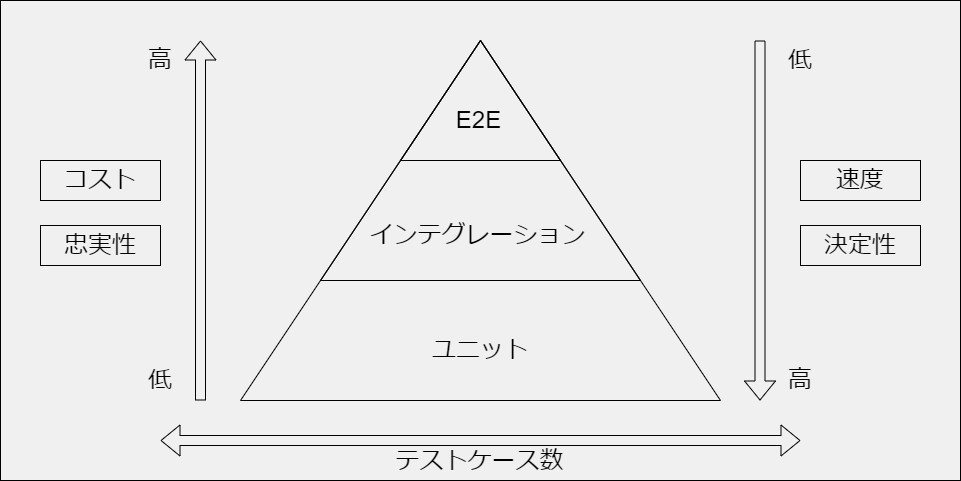
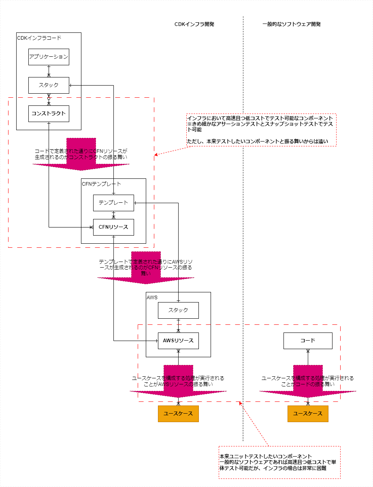

この記事は[NTTテクノクロス Advent Calendar 2024シリーズ2](https://qiita.com/advent-calendar/2024/ntt-tx)の24日目の記事であり、翌日25日の記事と合わせた連載の第1回目になります。

こんにちは。NTTテクノクロスの堀江です。普段はAWSやAzure上でのシステム設計、構築や実装、調査検証系の案件を幅広く担当しています。

---

# はじめに

本記事では、「テストピラミッド」の概念を用いて、AWS CDKで実装するインフラの適切なテスト戦略を模索していきます。
テストピラミッドは一般的なソフトウェア開発におけるテスト戦略 - どの様なテストを、どの程度実装・実施すべきか - を検討する上で頻繫に用いられる概念です。それをインフラに対するテスト戦略としても運用可能か、インフラのテストにおけるテストピラミッドはどの様な形になるか、といったことを本記事では模索します。

私は今年度の業務から(遅ればせながら)AWS CDKを本格的に使い始め、その過程でこの取り組みに思い至りました。
AWS CDKではコード(コンストラクト)やAWS上のリソースに対して様々な自動テストを実施するためのモジュールが提供されています。それらのモジュールの使い方(各種テストの実装方法)は比較的容易に習得できたものの、「**どのテストを、何を対象に、どの位実行すべきか**」、といったテスト戦略を、(私のCDK利用経験が浅いこともあり)納得のいく形で確立し運用することが出来ませんでした。
結果的に、今年度業務内で実装したテスト及びそのプロセスは、生産性や品質の面であまり効果的では無いものとなりました。例えば、テストの実装とテストが成功するまでの試行錯誤がインフラのデプロイプロセス上の大きなボトルネックとなったり、振り返るとあまり意義の感じられないテストコードを大量に書いてしまっていたり、といった具合です。(勿論テストを実装したことで開発・運用が効率化された面や品質が向上したと実感出来る点も確かにありました。)

**その様な経緯を踏まえ、一般的なソフトウェア開発におけるテスト戦略を検討するうえで信頼できる指針である「テストピラミッド」の概念を用いて、AWS CDKで実装したインフラに対する適切なテスト戦略を模索し理論化することに思い至りました。**

:::note info
この取り組みの大前提として、「一般的なソフトウェア開発同様、インフラに対してもテストを行うことでインフラの品質 - 監視やバックアップ等の要件が正しく実装され動作する割合 - が向上する」という命題が真である必要がありますが、本記事ではひとまずその点は自明であるとさせてもらいます。
:::

この取り組みは、本記事【論理編】と明日公開されるもう一つの記事【実践編】との2部構成となります。

- 【論理編】
  - まずは模索を進める上で前提となる幾つかの情報・用語を棚卸しします
    - まずはAWS CDKで実装したインフラに対してテストを実装するために利用可能な具体的なモジュールやライブラリを簡単に紹介します
      <!-- - なお、取り上げるものは基本的に標準的なもの - [`aws-cdk`モジュール](https://docs.aws.amazon.com/cdk/api/v2/docs/aws-construct-library.html)から提供されているようなもの -　に限定します -->
    - 次に、一般的なソフトウェア開発におけるテストの分類(テストカテゴリ)を紹介し、本記事内でのそれらの定義づけを行います
      - 一般的なソフトウェア開発におけるテストの分類は様々ありますが、本記事ではその中から代表的な、**「ユニットテスト」「インテグレーションテスト」「E2Eテスト」** の3種類を採用します
  - 必要な前提用語が出揃ったら、次に一般的なソフトウェア開発におけるテスト戦略の大きな指針となる「**テストピラミッド**」の考えを紹介します
    - 一般的なソフトウェア開発におけるテストピラミッドの考えがどの様なもので、そのピラミッド上では各種テストカテゴリ(ユニットテスト、インテグレーションテスト、E2Eテスト)がどの様な性質を持っているとされるのかを整理します
    - そのうえで、インフラにおけるユニットテスト、インテグレーションテスト、E2Eテストとは具体的にどの様なテスト手法であり、どの様な性質を持つのかを明らかにし、それらのテストがテストピラミッドの考えに適合するかを検討します
    - **ここでの主な結論の一つとして、インフラにおける「ユニットテスト」は一般的なソフトウェア開発における「ユニットテスト」とは異なり、単純にテストピラミッドの考えを流用は出来ないことを示します。**
    - そして、「ユニットテスト」というテストカテゴリに代わるより適切なインフラのテストカテゴリの1つとして、「**コンパイルテスト**」というカテゴリを導入します
    - またそれに関連して、インフラにおける「ユニットテスト」と「インテグレーションテスト」というカテゴリの区別は非常に曖昧であることから、それら2つに取って代わるより適切なカテゴリとして、「**機能テスト**」というカテゴリも新たに導入します
    - 最後に、「コンパイルテスト」「機能テスト」「E2Eテスト」から成るインフラの適切なテストピラミッドの図を描画し、そこから得られる教訓を示します


- 【実践編】
  - 理論編で整理した理論を基に、シンプルなWEBアプリケーションのCDKコードを題材として、コンパイルテスト、機能テスト、E2Eテストを実装・実施し、実際にテスト戦略を運用する過程をデモンストレーションします
    - コンパイルテスト(きめ細かなアサーションテスト)に関しては、どの様な観点にフォーカスしてテストを実装するのが効果的かも併せて検討し、実装例を提示します
    - 機能テストに関して、CDKコードに対しても一般的なソフトウェア開発におけるプラクティス - デザインパターンやSOLID原則 - を意識することでテストの実行速度やコストを改善出来る可能性があることを示します

- その他補足事項
  - 【理論編】【実践編】共に、扱うコードはTypeScriptとします
  - 本取り組みで述べられる「インフラ」は、基本的にAWS CDKで実装され、AWS上に構築された(される)インフラのことを意味します

:::note warn
タイトルの通り、本記事で述べるのは非常に模索的な内容です。つまり、長年の経験や大人数のフィードバックを経て確立され成熟した理論やプラクティスを紹介するものではありません。私個人の極めて模索的な内容となります。

その為、ここで提唱した理論の効果は全く保証出来ません。私自身今後の業務や自己学習の中で実践して効果を検証し、欠点をフィードバックしていきたいと思っています。首尾よく行けば来年のアドベントカレンダーでその中間報告をするかも知れません。
本記事はその様な未熟な内容ですが、それでも読んで貰えるのであれば大変嬉しいです。
:::

---

# 前提情報の棚卸し

## AWS CDKにおけるテストの実装手法

ここでは、CDKで実装したインフラに対してテストを実装するために選択肢となる具体的なモジュールやライブラリを簡単に紹介します。**ここで紹介したテスト手法を、最終的にはテストピラミッド上にマッピングしていくことになります**。なお、ここではサードパーティーが提唱・開発している手法は極力取り上げず、可能な限りAWSの公式に近い手法にフォーカスします。

---

### きめ細かなアサーションテスト

[きめ細かなアサーションテスト](https://docs.aws.amazon.com/ja_jp/cdk/v2/guide/testing.html#testing_fine_grained)は、CDKコードから生成されたCFNテンプレート上のリソースやアウトプットに、期待通りの値が設定されているかをテストする手法です。[aws-cdk-libのassertionsモジュール](https://docs.aws.amazon.com/cdk/api/v2/docs/aws-cdk-lib.assertions-readme.html)にて提供されています。

<details><summary>きめ細かなアサーションテストの例</summary>

```js:きめ細かなアサーションテストの例
import { aws_ec2 as ec2, Stack } from "aws-cdk-lib";
import { Template } from "aws-cdk-lib/assertions";

const stack = new Stack();
new ec2.Vpc(stack, "VPC", {
  maxAzs: 4,
  subnetConfiguration: [
    { subnetType: ec2.SubnetType.PUBLIC, name: "Public", cidrMask: 24 },
  ],
});
const template = Template.fromStack(stack);
test("サブネットが合計2つ作成される", () => {
  template.resourceCountIs("AWS::EC2::Subnet", 2);
});
```

</details>

:::note info
きめ細かなアサーションテストを効率的かつ高速に実装するライブラリとして、aws-cdk-utulをリリースしました。
興味のある方は[こちらのアドベントカレンダー記事](https://qiita.com/horietakehiro/items/ef1629242d8130c9b88d)をご確認ください。
:::

---

### スナップショットテスト

[スナップショットテスト](https://docs.aws.amazon.com/cdk/v2/guide/testing.html#testing_snapshot)は、CDKコードから生成されたCFNテンプレートを以前のもの(スナップショット)と比較し、差分の有無を確認するためのテストです。スナップショットテスト自体はHTMLページといったUIコンポーネントの差分をテストする概念としても一般的であり、[jest](https://jestjs.io/ja/docs/snapshot-testing)の機能として提供されています。

<details><summary>スナップショットの例</summary>

```js:スナップショットテストの例
import { aws_ec2 as ec2, Stack } from "aws-cdk-lib";
import { Template } from "aws-cdk-lib/assertions";

const stack = new Stack();
new ec2.Vpc(stack, "VPC", {
  maxAzs: 4,
  subnetConfiguration: [
    // 一度cidrMask: 24でスナップショットを作成し、その後cidrMask: 26に更新する
    // { subnetType: ec2.SubnetType.PUBLIC, name: "Public", cidrMask: 24 },
    { subnetType: ec2.SubnetType.PUBLIC, name: "Public", cidrMask: 26 },
  ],
});
test("スナップショットテスト", () => {
  expect(template).toMatchSnapshot();
});
```

```bash:スナップショットテストの例
$ npm test test/unit/snapshot.test.ts

... 省略 ...

  ● スナップショットテスト

    expect(received).toMatchSnapshot()

    Snapshot name: `スナップショットテスト 1`

    - Snapshot  - 2
    + Received  + 2

    @@ -81,11 +81,11 @@
                  {
                    "Fn::GetAZs": "",
                  },
                ],
              },
    -         "CidrBlock": "10.0.0.0/24",
    +         "CidrBlock": "10.0.0.0/26",
              "MapPublicIpOnLaunch": true,
              "Tags": [
                {
                  "Key": "aws-cdk:subnet-name",
                  "Value": "Public",
    @@ -153,11 +153,11 @@
                  {
                    "Fn::GetAZs": "",
                  },
                ],
              },
    -         "CidrBlock": "10.0.1.0/24",
    +         "CidrBlock": "10.0.0.64/26",
              "MapPublicIpOnLaunch": true,
              "Tags": [
                {
                  "Key": "aws-cdk:subnet-name",
                  "Value": "Public",

      16 |
      17 | test("スナップショットテスト", () => {
    > 18 |   expect(template).toMatchSnapshot();
         |                    ^
      19 | });
      20 |
```
</details>

---

### integ-tests

[integ-tests](https://aws.amazon.com/jp/blogs/news/how-to-write-and-execute-integration-tests-for-aws-cdk-applications/)はCDKコードからデプロイされたCFNスタックに対して、自動化されたインテグレーションテスト(結合テスト)を実行する為のモジュールです。
下図のように、テスト対象となる一連のリソース群とテストシナリオをCFNスタックとして定義・デプロイする形でインテグレーションテストを実行することが可能です。

:::note warn
integ-testsモジュールは2024年11月時点ではまだアルファ版のみが利用可能です。各自で利用される際はその点をご留意ください。また、本記事の記載内容と今後の更新内容が大きく乖離する可能性にご注意ください。
:::

<details><summary>integ-testsの例</summary>

```js:integ-testの例
import { ExpectedResult, IntegTest } from "@aws-cdk/integ-tests-alpha";
import { App, RemovalPolicy, Stack, aws_s3 as s3 } from "aws-cdk-lib";
import { PutObjectCommandInput } from "@aws-sdk/client-s3";

const app = new App();
// インテグレーションテスト対象とする一連のリソース群をスタックとして定義
// パブリックアクセス可能なS3バケットを作成する
const stack = new Stack(app, "stack-under-test");
const publicBucket = new s3.Bucket(stack, "PublicBucket", {
  publicReadAccess: true,
  blockPublicAccess: s3.BlockPublicAccess.BLOCK_ACLS,
  removalPolicy: RemovalPolicy.DESTROY, autoDeleteObjects: true,
});
const objectKey = "test-object";
const objectBody = "test";

// 上で定義したスタックを対象とするテストケースを定義
const integ = new IntegTest(app, "test-bucket-public-access", {
  testCases: [stack],
});
// テスト用のオブジェクトをアップロートし、パブリックアクセス(GET)可能であることをテストする
integ.assertions
  .awsApiCall("@aws-sdk/client-s3", "PutObject", {
    Bucket: publicBucket.bucketName,
    Key: objectKey,
    Body: objectBody,
  } as PutObjectCommandInput)
  .next(
    integ.assertions.httpApiCall(
      `https://${publicBucket.bucketName}.s3.${stack.region}.amazonaws.com/${objectKey}`
    )
  )
  .expect(ExpectedResult.objectLike({ body: objectBody }));
```

```bash:integ-testの例
$ npx integ-runner --directory test/integration/ --parallel-regions ap-northeast-1   --update-on-failed
...省略...

Running integration tests for failed tests...

Running in parallel across regions: ap-northeast-1
Running test /home/horie-t/workspace/advent-calendar-2024/test/integration/tmp/integ.app.ts in ap-northeast-1
  SUCCESS    integ.app-test-bucket-public-access/DefaultTest 164.331s
       AssertionResultsHttpApiCall153ddd9a4762d5bdcdd63b9d9d489185 - success

Test Results:

Tests:    1 passed, 1 total
```

</details>

---

### CDKパイプラインステージ

AWS CDKでは[CDK Pipelineモジュール](https://docs.aws.amazon.com/cdk/api/v2/docs/aws-cdk-lib.pipelines-readme.html)を利用することで、CDKコードのCI/CDを効率的に実現することが可能です。その処理の一環として、[CDKコードのデプロイステージの前後に自動テストを実行するステージを追加することが可能です。](https://docs.aws.amazon.com/ja_jp/cdk/v2/guide/cdk_pipeline.html#cdk_pipeline_validation)
これによって、AWS上にデプロイされたインフラに対して自動化されたテストを実施することが可能です。

<details><summary>デプロイされたリソースに対するテストステージの実装例</summary>

```js:デプロイされたリソースに対するテストステージの実装例
import * as cdk from 'aws-cdk-lib';
import { Construct } from 'constructs';
import { CodePipeline, CodePipelineSource, ShellStep } from 'aws-cdk-lib/pipelines';
import { MyPipelineAppStage } from './my-pipeline-app-stage';

export class MyPipelineStack extends cdk.Stack {
  constructor(scope: Construct, id: string, props?: cdk.StackProps) {
    super(scope, id, props);

    // CI/CDパイプラインの定義
    const pipeline = new CodePipeline(this, 'Pipeline', {
      pipelineName: 'MyPipeline',
      synth: new ShellStep('Synth', {
        input: CodePipelineSource.gitHub('OWNER/REPO', 'main'),
        commands: ['npm ci', 'npm run build', 'npx cdk synth']
      })
    });
    // アプリケーションスタックをデプロイするステージ
    const deployStage = pipeline.addStage(new MyPipelineAppStage(this, "test", {
      env: { account: "111111111111", region: "eu-west-1" }
    }));

    // デプロイされたアプリケーションに対するテストステージを追加
    deployStage.addPost(new ShellStep("validate", {
      commands: ['../tests/validate.sh'],
    }));

  }
}

```

</details>

---

### その他

CDKコードをテストするための手法として他にも以下のような選択肢を挙げることが可能ですが、後述するテストピラミッドとの対比関係を検討していく上ではあまり関係しないため、本記事では基本的に取り上げないこととします。

- [Aspects](https://docs.aws.amazon.com/ja_jp/cdk/v2/guide/aspects.html)や[addValidation](https://docs.aws.amazon.com/cdk/api/v2/docs/constructs.Node.html#addwbrvalidationvalidation)、[Annotations](https://docs.aws.amazon.com/cdk/api/v2/docs/aws-cdk-lib.Annotations.html)機能を利用した合成時のバリデーション
- [cfn-nag](https://github.com/stelligent/cfn_nag?tab=readme-ov-file)や[CloudFormation Guard](https://docs.aws.amazon.com/cfn-guard/latest/ug/what-is-guard.html)といったツールを利用したセキュリティ設定、コンプライアンス設定チェック

### 各種CDKテスト手法のまとめ

| テスト手法                   | 概要                                                                                                          |
| ---------------------------- | ------------------------------------------------------------------------------------------------------------- |
| きめ細かなアサーションテスト | CDKコードから期待通りにCFNテンプレートが生成されることを確認するテスト                                        |
| スナップショットテスト       | CFNテンプレートがに意図しない変更が発生したいこと(或いは発生した変更が意図した内容であること)を確認するテスト |
| integ-tests                  | テスト対象のリソースをAWS上にデプロイして期待通りに動作すすることを確認するテスト                             |
| CDKパイプラインステージ      | CI/CDパイプラインの処理の一環で、デプロイされたリソースが期待通りに動作することを確認するテスト               |

---

## 一般的なソフトウェア開発におけるテストカテゴリ

次に、一般的なソフトウェア開発におけるテストの分類(テストカテゴリ)及びその定義を紹介します。
一般的なソフトウェア開発におけるテストをカテゴライズするための用語には様々なものがありますが、本記事ではその中から下記3種類のテストカテゴリを取り上げます。

- **ユニットテスト**
  - ソフトウェアを構成するコンポーネントの最小単位(関数やメソッド等)の振る舞いに対するテスト
- **インテグレーションテスト**
  - 複数のコンポーネント同士の連携や、DB等の外部リソースへのアクセスを伴う、より大きな纏まり(ユースケースレベル)の振る舞いに対するテスト
- **E2Eテスト**
  - エンドユーザに利用されるのと同じ状態のソフトウェア(≒製品としてデプロイされた状態のソフトウェア)に対して、エンドユーザが利用するのと同じ方法(インターフェース)で利用した際の振る舞いに対するテスト

これらのテストカテゴリの定義は人によって様々かと思います。また、例えばインテグレーションテストは「サービステスト」、E2Eテストは「UIテスト」といった表現もあり得るかも知れませんが、本記事では上記3つのテストカテゴリに対して、上記の定義を一貫して当てはめて使用していこうと思います。

:::note warn
上に挙げた分類法は言わば「**テストの対象(スコープ)**」にフォーカスしたものですが、一方で[Googleが2010年頃から提唱し始めた](https://testing.googleblog.com/2010/12/test-sizes.html)もう一つの分類法として、「**テストの大きさ(サイズ)**」にフォーカスしたものもあります。

後者は、単一マシンの単一プロセス内に収まるテストは小、単一マシンンの複数プロセスに跨るテストは中、複数マシンに跨るテストは大、といった具合にテストを分類する手法です。前者の分類法と比較してテストの定義がより明確になるといったメリットがあります。

詳細は後述しますが、CDKインフラ開発におけるテストの殆どはAWS上のリソースに対するテスト(=大テスト)であることから、テストサイズによる分類は有効では無いと判断し、本記事では従来のテストスコープによる分類法を用いています。
:::

---

# テストピラミッドを用いた考察

ここまで、テスト戦略の問いを検討するうえで前提となる材料を棚卸ししてきました。それらの情報と、「テストピラミッド」の概念を用いて、インフラに対するテストピラミッドを考察します。

## 一般的なソフトウェア開発におけるテストピラミッド

テストピラミッドは[Mike Cohn氏](https://en.wikipedia.org/wiki/Mike_Cohn)氏が2009年の書籍「[Succeeding with Agile](https://www.amazon.co.jp/-/en/Mike-Cohn/dp/0321579364)」で提唱した概念です[^1]。ソフトウェア開発におけるユニットテスト・インテグレーションテスト・E2Eテスト(Mike氏の分類では「UIテスト」)を以下の4観点で分析し、それらをそれぞれどの程度の割合で実施すべきなのかをについて重要な指針を提供します。

- テストに掛かる**コスト**(テストケースの記述コストと実行時のコスト)
  - 記述にコストが掛かるテストは、それだけ開発やリリースの速度を低下させる恐れがある。また、実行時のコスト(マシンリソース使用率や金銭)が高いテストも、テストの実行を躊躇わせる要因になる
- テスト時のコンポーネントの振る舞いの**忠実度**
  - テスト時のコンポーネントの挙動や実行条件が、ソフトウェアの本物のそれらを反映している度合い
  - テスト時に実行されるコンポーネントののスコープが限定されていたり、テストダブルやダミーデータ、インメモリDBを使用したテストであるほど振る舞いの忠実度は低いと言える
  - 忠実度の高い条件下でテスト出来るほど、そのソフトウェア本来の動作をテスト出来ていると言えるので、ソフトウェアの信頼性は高まる
- テストの実行速度
  - テストを実行してから終了(結果が判明)するまでに掛かる時間
  - 実行時間が長ければ、それだけ開発やリソースのボトルネックとなる
- テストの決定性
  - 同じ条件で同じ内容のテストを複数回実行した際に、毎回必ず同じ結果が得られる可能性
  - 長時間要し、外的な要因(インターネット通信や外部サービスとの連携)が関連するテストほど決定性は下がる。決定性が低いテストはテストそのものの信頼性を下げ、引いてはソフトウェアの品質にも自信が持てなくなる要因となる

[和田卓人氏](https://gihyo.jp/author/%E5%92%8C%E7%94%B0%E5%8D%93%E4%BA%BA#rt:/dev/serial/01/savanna-letter/0005)の以下の説明[^2]がより端的に分かり易いので、併せて引用させていただきます。

> テストピラミッドとは、コスト（記述コストと実行コスト）と忠実性（本物の挙動を反映している度合い）が高く、実行速度と決定性（テストが毎回同じように安定して動く度合い）が低いテストほどケース数を減らすべきだという、自動テストケース数の望ましい比率をピラミッド型に視覚化したものです。

テストピラミッドは以下の様な図[^3]で表現出来ます。


<!--  -->

この図が意味するところは以下の通りです。

- コストが低くて実行速度が速く、決定性が高い代わりに忠実度が低いテストは手厚く実装すべきである。(ピラミッド(三角形)の最下部を構成するようなイメージ)
  - ※一般に**ユニットテスト**がこの性質に該当する
- コストが高くて実行速度が遅く、決定性が低い代わりに忠実度が高いテストは実装数を抑えるべきである。(ピラミッド(三角形)の最上部を構成するようなイメージ)
  - ※一般に**E2Eテスト**がこの性質に該当する
- コストや実行速度、決定性が上記2つの中間的なテストは、上記2つの中間を占める程度の実装数とすべきである。(ピラミッド(三角形)の中段を構成するようなイメージ)
  - ※一般に**インテグレーションテスト**がこの性質に該当する
- ピラミッドの下部を構成するテスト(ユニットテスト)でソフトウェアの大部分(コンポーネントの多種多様な挙動)のテストをカバーできるようなソフトウェアの実装を目指すべき(適切に設計やリファクタリングを行う等して)
- かといって、テストすべき全ての振る舞いをユニットテストとしてテスト出来るわけでは無く、E2Eテストやインテグレーションテストも(数は抑えるべきだが)実施が不可欠である

上図のピラミッドが構成されるような割合でテストを実装することで、ソフトウェアの開発速度と品質(信頼性)を高いレベルで両立することが出来ると一般的に考えられています。

テストピラミッドはあくまで一般的なソフトウェア開発に対するテスト戦略の指針として用いられています。では次に、この考えをCDKインフラ開発におけるテスト戦略にも流用することが出来るのかを考察します。

---

## CDKインフラ開発におけるテストピラミッド

前述したテストピラミッドの考え、及びそこから導き出されるテスト戦略を、CDKインフラ開発にも流用することが出来るのかを考えます。

アプローチは以下の通りです。
- まず前提として挙げた3つのテストカテゴリ - ユニットテスト、インテグレーションテスト、E2Eテスト - がCDKインフラ開発においてどの様なテストのことを具体的に意味するのかを整理します
- 次にそれらのテストの、テストピラミッド上の位置づけ(実行速度やコスト面の性質)を検討します
- インフラ開発における各テストのテストピラミッド上の位置づけが、一般的なソフトウェア開発におけるそれと同様であるかを確認します
  - **例えばCDKインフラ開発における「ユニットテスト」が、一般的なソフトウェア開発におけるそれと同様の性質(コストや速度等)を有するのであれば、前述した回答 - コンポーネントの最小単位の振る舞いを対象とした、ユニットテストを、沢山実施すべき - をインフラ開発においても流用出来ると言えます**

---

### CDKコードにおけるユニットテスト(コンパイルテスト)

本記事におけるユニットテストの定義と、テストピラミッドにおけるユニットテストの性質は以下の通りでした。

| 定義                                             | 性質                                                           |
| ------------------------------------------------ | -------------------------------------------------------------- |
| コンポーネントの最小単位の振る舞いに対するテスト | コストが低くて実行速度が早く、決定性が高い代わりに忠実度が低い |

この定義に基づくCDKインフラ開発における「ユニットテスト」とはどの様なテストを意味するのかを考えるために、まずはこの定義の、「コンポーネントの最小単位」と「振る舞い」をもう少し掘り下げて考えてみます。
一般的なソフトウェア開発における「コンポーネントの最小単位」とはコードとして記述された関数やメソッドだと述べました。そしてその「振る舞い」とは、当然ながら実際にそのコードが実行された際に行われる処理と言えます。また、そしてそもそも何故ソフトウェア開発において「振る舞い」をテストしたいのでしょうか。それはソフトウェアとして最終的に実現したいユースケースが、ソフトウェアコンポーネントの「振る舞い」の集合によって構成されているからに他なりません。
では、インフラにおいて最終的に実現したいユースケースを構成する「コンポーネントの最小単位」と、その「振る舞い」とは何でしょうか。それは**ユースケースに関わる各種AWSリソース(やAWSリソース上で稼働するコード)であり、「振る舞い」はそれらがAWS上で動作すること**に他なりません。

つまり、上述の定義に則ったCDKインフラ開発における「ユニットテスト」とは、「**AWSリソース個別の、AWS上での動作をテストすること**」という定義になります。では、そのようなテストがテストピラミッドの最下層を構成するテストの「コストが低くて実行速度が速く、決定性が高い代わりに忠実度が低い」という性質を満たしているのでしょうか。答えは基本的にNoでしょう。

| テストピラミッドの4観点 | AWSリソースの動作試験の特徴                                                                                          |
| ----------------------- | -------------------------------------------------------------------------------------------------------------------- |
| コスト                  | リソースの実行には直接的に金銭コストも掛かる。またテストダブルの用意にも手間が掛かり、記述コストも高い               |
| 速度                    | リソースの作成・削除は数秒～数十分掛かる。長時間を要するテストケースも想定される。                                   |
| 決定性                  | AWSリソースの操作はパブリックなNWを経由する必要があり、AWSサービス自体の更新や障害の影響を受けるため、決定性は低い。 |
| 忠実度                  | 実際にAWS上で動作する通りの動作をテストするので、忠実度は高い                                                        |

このことから、**CDKインフラ開発における「ユニットテスト」の定義に則ったテストは、一般的なソフトウェア開発における少なくともインテグレーションテストに相当する性質を有しているといえます**。言い換えれば、CDKインフラ開発における「ユニットテストは、一般的なソフトウェア開発におけるユニットテストのような手軽さで実施できるものではない、と言えます。


では逆に、一旦ユニットテストの定義は無視し、テストピラミッドの最下層を構成するような、手軽に実行出来る性質を持ったテストが、CDKインフラ開発におけるテストとして何か無いか逆引きしてみましょう。前述したテスト手法の中では、**「きめ細かなアサーションテスト」と「スナップショットテスト」がそれに該当すると言えます**。これらのテストはローカルマシン上のCDKコードを対象とするテストであるため、高速且つ低コストで実施可能です。ただし、AWS上のAWSリソースの振る舞いを実際にテストしている訳では無いので、忠実度は非常に低いと言えます。

| テストピラミッドの4観点 | きめ細かなアサーションテストとスナップショットテストの特徴                                 |
| ----------------------- | ------------------------------------------------------------------------------------------ |
| コスト                  | ソフトウェア開発におけるユニットテストと同等の形式で実装でき、実行に必要なリソースも少ない |
| 速度                    | 数秒～1分程度で実行可能                                                                    |
| 決定性                  | 基本的にローカルマシン上で完結する(依存する外部リソースが無い)ため、決定性は高い           |
| 忠実度                  | 実際のAWS上のAWSリソースの動作を試験している訳では無いので、忠実度は(かなり)低い           |

これらのテストは「ユニットテスト」と明確に区別して扱う為に、本記事では以下のような定義を与えたいと思います。

- **コンパイルテスト**
  - コンポーネントの生成に関する振る舞いに対するテスト
  - 高速且つ低コストで決定性が高い代わりに、実際のコンポーネントの振る舞いを対象にしている訳では無いので、忠実度は非常に低い

:::note warn
特にAWS CDKにおいては、「コンポーネントの生成に関するテスト」を表現する言葉として、「synthesize test(合成テスト)」という言葉がより実態に即した言葉だとは思いますが、[ソフトウェアのE2Eな振る舞いを継続的に監視するための「synthetic test(synthetic monitoring)」](https://en.wikipedia.org/wiki/Synthetic_monitoring)というテストカテゴリが既に存在しているため、ここでは「コンパイルテスト」という表現を採用します。
:::

少し長くなってしまったので、図も交えてここまでの内容を纏めます。


<!--  -->

- **インフラにおいて、「コンポーネントの最小単位の振る舞い」に対するユニットテストは、実際にAWS上のリソースの動作をテストすることに相当します。しかしその類のテストは、「コストが低くて実行速度が速く、決定性が高い代わりに忠実度が低い」という、テストピラミッドの下部を構成するための特徴を伴いません**
- **逆に、「コストが低くて実行速度が速く、決定性が高い代わりに忠実度が低い」という特徴を伴う、CDKコードで利用可能なテスト手法として、きめ細かなアサーションテストやスナップショットテストが該当します。しかしこれらは本来テストしたい対象をテスト出来ている訳では無いので、ユニットテストの定義を満たしません**
- 後者のようなテストは「コンパイルテスト」と定義して、前者と明確に区別していきます

以上から、一般的なソフトウェア開発におけるテストピラミッドが示す教訓 - (コンポーネントの最小単位の振る舞いを対象とする)ユニットテストは沢山実施すべき - は、CDKインフラ開発にはそのまま当てはめることが出来ず、以下のように改訂する必要があります。

- (コンポーネントの生成に関する振る舞いを対象とした)コンパイルテストを、中程度実施すべき
  - 何故ならコンポーネントの生成に関する振る舞いは、最終的にテストしたいAWSリソースの振る舞いとは根本的に異なり、テストの効果は限定的であるため

---

### CDKコードにおけるインテグレーションテスト(機能テスト)

本記事におけるインテグレーションテストの定義と、テストピラミッドにおけるインテグレーションテストの性質は以下の通りでした。

| 定義                                                                                                       | 性質                                       |
| ---------------------------------------------------------------------------------------------------------- | ------------------------------------------ |
| 複数のコンポーネント同士の連携や外部リソースへのアクセスを伴う、ユースケースレベルの振る舞いに対するテスト | コスト・実行速度・決定性・忠実度共に中程度 |

ところで前章にて、CDKコードにおけるユニットテストはAWSリソースの動作に対するテストであり、一般的なソフトウェア開発におけるインテグレーションテスト相当の性質を持っているものと解釈しました。CDKにおけるユニットテストもインテグレーションテストも、テスト対象は(一つ以上の)AWSリソースのAWS上での実際の振る舞いであり、その性質(テストに掛かるコストや決定性)も似ていることを考えると、両者の境界は非常に曖昧になっていきます。「インテグレーションテスト」という表現はある意味「ユニットテスト」との対比・差異を強調するための表現でもあると考えれば、両者の境界が曖昧な今、CDKコードにおけるユニットテストとインテグレーションテストを包括したより適切な **「機能テスト」** というテストカテゴリをここで追加したいと思います。


- **機能テスト**
  - 一つ以上のAWSリソースの振る舞いやAWSリソース間の連携、外部リソースへのアクセスを伴う、ユースケースレベルの振る舞いに対するテスト
    - 例えば「AWS CloudWatchアラームからSNSトピックを経由してアラーム情報をメール送信する」といったような、インフラ観点のユースケースに対するテスト
  - コスト・実行速度・決定性・忠実度共にテストケースごとに分散が大きいが平均して中程度。また、テストケースやCDKコードの実装を工夫することである程度は改善可能

では、CDKインフラ開発におけるインテグレーションテスト、もとい機能テストは、テストピラミッドにおけるインテグレーションテスト相当の性質を持っていると言えるでしょうか？条件付きではありますが、概ねYesだと言えるでしょう。

| テストピラミッドの4観点 | インフラ観点のユースケースに対するテストの性質                                                                                                                                        |
| ----------------------- | ------------------------------------------------------------------------------------------------------------------------------------------------------------------------------------- |
| コスト                  | リソースの実行には直接的に金銭コストも掛かる。またテストダブルの用意にも手間が掛かり、記述コストも高い。**ただし後述のようにテストケースを工夫することある程度まで改善可能**          |
| 速度                    | リソースの作成・削除は数秒～数十分掛かる。テストの所要時間はテストケースに依る(数秒～数日)。ただしコストと同様に工夫次第で改善可能                                                                                            |
| 決定性                  | AWSリソースの操作はパブリックなNWを経由する必要があり、AWSサービス自体の更新や障害の影響を受けるため、決定性は低い。                                                                  |
| 忠実度                  | 実際にAWS上で動作する通りの動作をテストするので、忠実度は高い。ただしダミーデータやダミーのアプリケーション、本来よりも小さいスペックのリソースを使用する場合はその分忠実度は下がる。 |

機能テストの実行速度やコストを改善するには、以下のようなテストケースの工夫が有効となります。

- テストの度にインフラを構成する全てのリソースのをデプロイするのではなく、テストケースごとに必要最小限のリソースのみを、必要最小限のスペックでデプロイしてテストすることでコストや実行時間をする
- インフラ上で稼働するアプリケーションやデータベースのデータがテストに必要な場合は、テストが容易なようにダミーのアプリやデータを使用して、テストケースをシンプルにする
- 一部のリソースを代替可能な別のリソース(≒テストダブル)に置き換えてテストすることで、コストや実行速度を削減できる。例えばALBのリスナーの挙動をテストする際に、本来ならターゲットグループとしてEC2のASGを用意する必要があるところを、テスト時のみLambda関数で代用する、といった具合

CDKコードに対してインテグレーションテスト、もとい機能テストを実施するためのテスト手法としては、「integ-tests」が該当します。デプロイすべきコンポーネントをCDKコンストラクトとして実装し、各ユースケースごとに必要最小限のコンストラクトをテスト用のスタックとして一時的にデプロイしテストすることで、コストや実行速度を最低限に保ちながらAWSリソースの実際の振る舞い、そしてユースケースをテストすることができるようになります。

以上から、一般的なソフトウェア開発におけるテストピラミッドの教訓 - (コンポーネント間の連携や外部リソースへのアクセスを伴うより大きなま振る舞いを対象とした)インテグレーションテストを、中程度実施すべき - は、以下のように改訂すべきです。

- 一つ以上のAWSリソースやリソース間の連携、外部リソースへのアクセスを伴う、ユースケースレベルの振る舞いを対象とした機能テストを、中程度実施すべき
  - その際実行速度やコストを最適化出来るようテストケースやCDKコードの実装を工夫すべき

---

### CDKコードにおけるE2Eテスト

本記事におけるE2Eテストの定義と、テストピラミッドにおけるE2Eテストの性質は以下の通りでした。

| 定義                                                                                                                                           | 性質                                                 |
| ---------------------------------------------------------------------------------------------------------------------------------------------- | ---------------------------------------------------- |
| エンドユーザに利用されるのと同じ状態のソフトウェアに対して、エンドユーザが利用するのと同じインターフェースで利用した際の振る舞いに対するテスト | コストは高く、実行速度と決定性が低いが、忠実度は高い |

インフラにおけるここでの「エンドユーザ」は、インフラ上で稼働されるアプリケーションやデータベース、あるいは運用者と解釈するのが適切でしょう。なのでインフラにおけるE2Eテストとは例えば「インフラ上で稼働するWEB3層アプリケーションがクライアントからのリクエストに期待通りのレスポンスを返すこと」や「インフラを構成する特定コンポーネントの異常時に通知が運用者に届くこと」を確認するためのテストとなります。これらのテストはインフラを構成するリソースが全て揃った状態、かつ、テストダブル(ダミーのアプリやAWSリソース)を使用せず実施する必要があります。

| テストピラミッドの4観点 | インフラ観点のユースケースに対するテストの性質                                                                                                                                                     |
| ----------------------- | -------------------------------------------------------------------------------------------------------------------------------------------------------------------------------------------------- |
| コスト                  | インフラを構成する全てのリソースがデプロイされている状態なので、その分の金銭的コストが掛かる。                                                                                                     |
| 速度                    | リソースの作成・削除は数秒～数十分掛かる。テストの所要時間はテストケースに依る(数秒～数日)                                                                                                         |
| 決定性                  | AWSリソースの操作はパブリックなNWを経由する必要があり、AWSサービス自体の更新や障害の影響を受ける。また、インフラ上で稼働させるアプリケーションやDBデータもダミーは使用できないため、決定性は低い。 |
| 忠実度                  | 実際のインフラの使われ方と(限りなく)同じ方法でテストするので、忠実度は非常に高い。                                                                                                                 |

この条件のインフラに対して実施可能なAWS CDKテスト手法は、「CDKパイプラインステージ」が考えられます。前述の通り、インフラを構成する全てのリソースがデプロイされている状態に加え、インフラ上で稼働するアプリケーションやDBデータも正規のものである必要があります。そのため、CI/CDパイプラインの処理としてデプロイが成功したインフラ全体に対してテスト出来るこの手法が適切であると言えます。また、このテストは、テストピラミッドにおけるE2Eテスト相当の性質も有していると言えます。

以上から、一般的なソフトウェア開発におけるテストピラミッドの教訓 - (エンドユーザに利用されるのと同じ方法で利用した際の振る舞いを対象とした)E2Eテストを、少数実施すべき - は、そのまま流用出来ると言えます。

---


# まとめ

ここまで、テストピラミッドを構成する各種テストカテゴリの定義に則り、該当するCDKコードのテスト手法を整理し、そのテスト手法がテストピラミッドを構成しえるかを検討してきました。その結果を今一度まとめます。

| テストカテゴリ | 定義 | テストピラミッド上の性質 | CDKテスト手法 |
| - | - | - | - |
| コンパイルテスト | コンポーネントの生成に関する振る舞いに対するテスト | 低コストで高速で決定性は非常に高いが、忠実度は非常に低い | きめ細かなアサーションテスト(及びスナップショットテスト) |
| 機能テスト | 一つ以上のAWSリソースの振る舞いやAWSリソース間の連携、外部リソースへのアクセスを伴う、ユースケースレベルの振る舞いに対するテスト | (テストケースにも依るが、)忠実度は高い代わりにコストも速度もそれなりに掛かり、決定性も高くない。ただしCDKコードやテストケースの実装の工夫次第で改善可能。 | integ-tests |
| E2Eテスト | エンドユーザに利用されるのと同じ方法で利用した際の振る舞いに対するテスト | 忠実度が非常に高いが、一般に高コストかつ低速で、決定性も高くない。 | CDKパイプラインステージ |

上記の整理から、インフラにおけるテストピラミッドは以下のような形状を描くことができると考えます。


<!--  -->

- **コンパイルテストを実装し過ぎない**。確かに高速かつ低コストで実行できるテストであるが、コンパイルテストは実際にAWSリソースの振る舞いをテストできるわけではない
- 代わりに**機能テストを厚く実装する**。実際にAWSリソースの振る舞いをテストできるテストを、可能な限り高速かつ低コスト、高い決定性で実施できるようにテストケースやCDKコードの実装を工夫する
- **E2Eテストの実装数は抑える**。一般的なソフトウェア開発同様、E2Eテストはコスト、実行速度共に掛かるため、必要最低限に留める


本記事の冒頭でも述べた通り、この理論は私一人の今年度限りの業務経験と僅かな知識にのみ依っている、大変脆弱な内容となっています。そのため、今後の業務の中でこの理論を運用し、効果や欠点を検証していきたいと思います。

本記事【理論編】は以上となります。次回【実践編】では、シンプルなWEBアプリケーションのCDKコードを題材に、実際にテストを実装・実施する一連の流れをデモンストレーションします。

---

## 参考文献

- [Test AWS CDK applications](https://docs.aws.amazon.com/cdk/v2/guide/testing.html)
- [Continuous integration and delivery (CI/CD) using CDK Pipelines](https://docs.aws.amazon.com/cdk/v2/guide/cdk_pipeline.html)
- [AWS CDK アプリケーションのためのインテグレーションテストの作成と実行](https://aws.amazon.com/jp/blogs/news/how-to-write-and-execute-integration-tests-for-aws-cdk-applications/)
- [単体テストの考え方/使い方 プロジェクトの持続可能な成長を実現するための戦略](https://book.mynavi.jp/ec/products/detail/id=134252)
- [The Practical Test Pyramid](https://martinfowler.com/articles/practical-test-pyramid.html)
- [サバンナ便り ～ソフトウェア開発の荒野を生き抜く～ 第5回 テストピラミッド ～自動テストの信頼性を中長期的に保つ最適なバランス～](https://gihyo.jp/dev/serial/01/savanna-letter/0005)
- [自動テストにおけるテストピラミッド](https://zenn.dev/jyoppomu/articles/52844385940140)
- [テストサイズで再考する「テストピラミッド」　Googleが提唱する効率的な自動テスト戦略](https://logmi.jp/main/technology/330972)
- [Googleのソフトウェアエンジニアリング ―持続可能なプログラミングを支える技術、文化、プロセス](https://www.oreilly.co.jp/books/9784873119656/)

## 脚注

[^1]: [Test Pyramid](https://martinfowler.com/bliki/TestPyramid.html)
[^2]: [サバンナ便り ～ソフトウェア開発の荒野を生き抜く～ 第5回 テストピラミッド ～自動テストの信頼性を中長期的に保つ最適なバランス～](https://gihyo.jp/dev/serial/01/savanna-letter/0005)より引用
[^3]: [サバンナ便り ～ソフトウェア開発の荒野を生き抜く～ 第5回 テストピラミッド ～自動テストの信頼性を中長期的に保つ最適なバランス～](https://gihyo.jp/dev/serial/01/savanna-letter/0005) [図1 テストピラミッド](https://gihyo.jp/assets/images/dev/serial/01/savanna-letter/0005/01.jpg)を基に自作